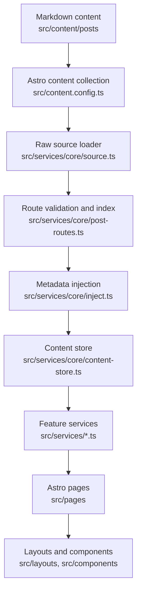

# Architecture

This project is a customized Mizuki-based static blog built with Astro, Svelte, Tailwind CSS, and Stylus. It is organized around a service layer so pages and components do not need to know the raw content implementation.

## Runtime Model

Astro builds the site statically. Content is loaded at build time through Astro content collections, transformed by `src/services/core`, and then passed into layouts and UI components.

Before development or build entrypoints start Astro, `pnpm content:prepare` selects the content source. Local mode leaves repository content untouched. External mode fetches one required commit SHA into staging, validates `posts`, `spec`, `data`, and `images`, promotes an immutable release, and switches the single `CONTENT_DIR/current` pointer. External preparation failures stop the command; they never fall back to local or stale content.



## Key Directories

| Path | Purpose |
| --- | --- |
| `src/pages` | Astro routes and API-like static endpoints. Keep pages thin. |
| `src/layouts` | Page shell and grid layout composition. |
| `src/components` | Astro and Svelte UI components. Domain presentation components live directly under feature-specific component folders. |
| `src/components/ui` | Renderable shared UI component implementations that consume the Design contract without owning business behavior. |
| `src/components/modules` | Stateful component modules with browser runtime logic, controllers, events, storage, or Svelte stores. |
| `src/design` | Sole owner of cross-feature visual tokens, themes, foundations, patterns, and legacy aliases. It must not contain Astro or Svelte components. |
| `src/services/core` | Content loading, sorting, derived metadata, taxonomy, and cached content store. |
| `src/services` | Feature-level data access for home, archive, categories, feeds, footer statistics, calendar data, and post detail pages. |
| `src/content` | Astro content collections for posts and special pages. |
| `src/data` | Typed data for non-post pages such as timeline, diary, friends, projects, devices, and skills. |
| `src/utils` | Shared utility functions for URLs, dates, content, panels, and client behavior. |
| `public` | Static files copied directly to the built site. |
| `scripts` | Local automation for content sync, post creation, anime data, fonts, and search indexing support. |
| `docs` | Maintained project documentation. |

Live2D Companion interaction details, including expression panel behavior, are owned by [Live2D Companion Maintenance](../developers/live2d-companion-maintenance.md).

## Service and View Model Boundaries

Large file splitting should preserve the existing service-oriented architecture:

- `src/services/` owns page logic, build-time data adaptation, configuration normalization, static path builders, and page-level view models.
- `src/pages/` should stay thin. A route should call services, compose layouts/components, and pass view models into presentation components.
- `src/components/` and `src/layouts/` own rendering and local presentation. Page-specific extracted components should be mostly presentational.
- `src/components/ui/` implements generic UI components on top of `src/design` tokens and `ds-` Pattern classes; it must not become a business placement registry.
- `src/components/modules/` owns component-level application modules. Module-local `controller.ts`, `runtime.ts`, `storage.ts`, `events.ts`, `state.ts`, and `types.ts` are allowed when they serve only that module.
- Runtime browser interaction state does not belong in `src/services/`. Keep DOM listeners, audio playback, pointer events, localStorage UI state, and Svelte runtime stores beside the owning component module.
- `src/services/core` remains the content pipeline boundary. Normal post collection data must continue to flow through `getContentStore()`.

Recommended split pattern for a thick route:

```text
src/pages/anime.astro
src/services/anime.ts
src/components/anime/
  AnimePage.astro
  AnimeToolbar.astro
  AnimeGrid.astro
  AnimeCard.astro
  types.ts
```

Recommended split pattern for a complex runtime module:

```text
src/components/modules/music-player/
  MusicPlayer.svelte
  MiniPlayer.svelte
  ExpandedPlayer.svelte
  PlaylistPanel.svelte
  audio-controller.ts
  storage.ts
  types.ts
```

Use module-local helpers and types first. Promote code to `src/utils` or shared services only after multiple unrelated modules reuse it.

Site notifications are Markdown content entries under `src/content/notifications`. `src/services/site-notice.ts` normalizes route visibility, applies notification defaults, and builds the Activity Center view model. Activity Center is Navbar-level infrastructure and must remain mounted even when the collection has no visible notifications. Astro renders notification Markdown at build time in `ActivityCenter.astro`; the Svelte runtime reads that trusted HTML from templates and owns dialog state, read state, dismissal state, acknowledgement state, and session-level auto-open/auto-expand suppression.

Activity Center is the Navbar-level information hub mounted at the top right. `src/components/modules/activity-center` composes notification summaries with browser-only article reading status (progress, current heading, remaining time, and a saved resume position). Its notification badge represents unread notices only; its ring represents reading progress only. Clicking a notification opens the full Markdown dialog and marks it read; acknowledgement is separate and only written by the explicit acknowledgement action. Notification `level` (`normal`, `important`, `urgent`, `critical`) controls ordering and interruption behavior: unread `important`/`urgent` notices auto-expand the panel once per browser session, while unacknowledged `critical` notices auto-open the dialog once per browser session. `pinned` is an independent display strategy for the single top notice and also auto-opens until read or acknowledged. Notification `status` (`info`, `success`, `warning`, `danger`) controls visual tone. Do not add action shortcuts here—viewport actions belong to Floating Tools.

Shell icons added by Activity Center and Floating Tools are repository assets under `src/assets/icons/material-symbols`. `src/components/ui/local-icons.ts` is the explicit registry consumed by the Astro and Svelte `LocalIcon` renderers. New icons in these Shell features must be downloaded and registered there; do not introduce runtime Iconify API dependencies. An unregistered dynamic notice icon falls back to the local information icon in Activity Center.

Floating Tools is a Shell-level interaction feature mounted by `MainGridContent.astro` outside the animated Main Content Layer. `src/components/modules/floating-tools` owns the bottom-right rail, responsive placement, and expansion state; Theme, Music, Settings, Floating TOC, and Back to Top retain their existing feature behavior and are composed into that rail. Floating TOC is a post TOC presentation surface, not an independent heading collector: it must consume the shared post TOC static/runtime data source and refresh contract. Settings is a viewport-bounded popover on desktop and a bottom sheet on mobile. Fixed-position controls must not be nested under transformed route containers or reintroduce independent viewport coordinates outside the Floating Tools placement owner.

Live2D Companion and Music Player configuration `enable` flags supply only the initial mounted state; they must not remove either Floating Tools entry. Visitor choices are stored separately as `live2d-companion-mounted` and `music-player-mounted`. Live2D Companion is a module-local Svelte runtime under `src/components/modules/live2d-companion` with an isolated iframe renderer at `/live2d-companion/live2d-host.html`; pages and other modules must use `src/components/modules/live2d-companion/events.ts` instead of iframe DOM access. Keep its outer mounted state, internal collapsed state, expanded position, collapsed avatar position, and model index as separate storage contracts. Detailed Live2D architecture, module ownership, model configuration, expression limits, drag behavior, iframe headers, and validation guidance live in [Live2D Companion Maintenance](../developers/live2d-companion-maintenance.md). Music Player owns Audio plus Default, Mini, Expanded, and Playlist state; `src/components/modules/music-player/events.ts` is the narrow UI contract through which Floating Tools only toggles module UI visibility and consumes explicit state/layout events. Default ↔ Mini uses one reversible morph, while Mini ↔ Expanded shares one surface geometry and easing contract in both directions. The Floating Tools switch uses keyframes generated by the same easing function and the panel transition start timestamp, so its FLIP transform stays on the same timeline in both directions. Floating Tools must not infer feature state from DOM mutations.

Page modules own their placement. Home passes `HomeSupport` through `MainGridLayout`'s named `support` slot, combining the profile card with site overview, global discovery cards, and tags. Category discovery starts at `/category/`, which renders the Category Hub's All Categories view; `/category/recent/` and `/category/recommended/` render the same Hub shell with recent-activity-sorted and score-sorted posts. Global discovery cards are built by `src/services/support.ts` and rendered by `GlobalDiscoveryCard.astro`: Category cards preview category links, while Recent and Recommended cards preview post links. Category Hub support hides the discovery card for the current Hub view and shows the other discovery cards; concrete category pages show all global discovery cards from the global post pool and keep category-local article lists, Tag filtering, and pagination in the main content area instead of duplicating them in the sidebar. Post-detail pages pass `PostSupport` for the only desktop in-page TOC plus the same global discovery cards; local related and random recommendations stay in the after-flow. Archive owns only date-oriented browsing through Calendar and Timeline; category and Tag discovery belongs to the Category Hub and concrete category pages. Site statistics are a Footer feature: `src/services/footer.ts` builds the view model from content-store metadata and `src/components/footer` renders it once. Footer height remains content-driven, with its outer, Stats, and Meta spacing owned by Footer-local tokens rather than a fixed Shell height. `PanelCard.astro` is only a visual container and must not become a placement registry.

The home and category pages own separate page compositions while sharing Post Card, Category Card, and Grid contracts. Home renders Recently Updated and Recommended sections with three-post limits; their section links route to `/category/recent/` and `/category/recommended/` to favor category discovery over the Archive. Home also renders a Category section that reuses the Category Hub card view model, caps the homepage preview at the first six categories, hides per-category recent post lists, and links the section header to `/category/`. Category Hub pages are discovery views, not taxonomy aliases: All Categories renders category cards with recent posts and popular tags, Recent uses `sortByRecentActivity()` output, and Recommended uses global `sortByScore()` output. Hub article-list views do not emit or consume a category Tag JSON index. Concrete category pages remain the canonical taxonomy browsing surface: category links point to `/category/{slug}/`, and post Tag links point to the owning category with `?tag={tagSlug}`. Category pages render twelve-post pages with their taxonomy filter in the main content area. Category SSG props retain only the current page and data-free pagination metadata. Each concrete category also emits one compact `/api/categories/{slug}.json/` index. After the initial page load, Svelte prefetches that index during browser idle time only while the page is visible, online, outside `Save-Data`, and above 2g; a valid Tag query always loads immediately even when prefetch was skipped. The module cache is keyed by the complete index URL, shares promises across prefetch, Tag pagination, history, and Tag changes, and retains at most three recently used category indexes. Prefetch does not mutate component state, and request-version checks prevent an obsolete response from updating the active view. Both renderers share the semantic class contract and styles in `src/components/modules/post-list/post-list.css`; its Card block size also owns the matching intrinsic placeholder, while cover ratio and Feed width breakpoints remain independent inline-size contracts. Category runtime URL, request state, history, filtering, and pagination behavior lives beside the category components in `src/components/category/category-page-client.ts`.

All `MainGridLayout` pages use the `container-content` strategy. Banner always remains viewport-wide, while Navbar and Main Shell share a `1280px` outer maximum width. Pages with support content use a maximum `992px` three-column Feed/main column plus a `248px–272px` support column from `1200px`, a maximum `656px` two-column Feed/main column plus support from `880px`, and a single-column stack below that. Ordinary `content` pages without support use a maximum `656px` below `1200px` and `992px` from `1200px`. The Feed enters three columns at `932px`; the resulting Grid Cards target about `320px` while retaining `296px` as the safe minimum. Post-detail header, Markdown body, cover, and after-flow blocks share the `--width-reading-wide` rail inside the main column so the article card stays aligned beside desktop support. The Shell no longer supports legacy root-font `pageScaling` or the old viewport Grid. The shared `--navbar-shell-height` drives the Navbar outer height, Main Content offset, Page Entry clearance, and runtime scroll thresholds; Navigation controls keep their independent `44px` target. Desktop post support placement is owned by `PostSupport`: the full support shell sticks as one unit with internal scrolling for TOC, followed by global discovery cards. Desktop TOC shows only root headings at the document start and end, and expands only the active root branch while the reader is inside the article body. Floating Tools remains the compact/mobile TOC entry.

Page Layout Policy and Post Feed presentation are separate contracts. Policy selects the responsive Shell Strategy and the page's desktop layout from configuration only; there is no user-facing Desktop Page Layout Preference. The post Feed is fixed to grid-first presentation; legacy list/grid storage must not write or imply page layout state.

Category listing and post-detail pages keep Banner geometry in Banner and Fullscreen modes but do not share home's Navbar state. Home alone uses `banner-aware` scroll behavior; category and post pages use a persistent `fixed-visible` Navbar. Normal visits, first-load direct category/post URLs, and browser history in either retained-Banner mode align the actual `.page-main-content` region through the Shell-owned eased entry animation, calculating the target by subtracting CSS `scroll-margin` clearance from the region's document coordinate. Browser history does not restore a cached Swup position: the Shell settles its Banner class without a `top` transition, starts the history-specific entry animation, and publishes progress `idle` only after that animation completes or is cancelled. Hash, Overlay, and None visits preserve their page-policy behavior. Never derive this entry position from a live Banner rectangle or a transient navigation URL.

Post detail routes remain thin: `src/pages/posts/[...slug].astro` owns static path generation and forwards the page model to `src/components/post-detail/PostDetailPage.astro`. Header, last-modified status, navigation, and page-level styles live beside that presentation component. Runtime consumers may continue to rely on the stable `#post-container` and `.markdown-content` hooks. `#post-container` also exposes normalized reading title and minute metadata for Activity Center; scroll state remains browser-local beside that feature. Static post TOC data is build-time data from Astro `headings`: desktop TOC renders initial anchors from that source, while mobile TOC and Floating TOC read the post TOC JSON carrier. Client code may update active, collapse, scroll, and indicator state, but ordinary posts must not regenerate TOC data by scanning the whole page. Dynamic or encrypted content must explicitly opt in to runtime TOC regeneration with the decrypted content root; encrypted posts do not expose static TOC items before unlock. Shared TOC data shaping, content-root resolution, scroll offsets, graph building, active-heading calculation, and refresh events belong under `src/components/post-toc/`; presentation components should not duplicate heading normalization or query the whole document. TOC active state is maintained by a shared runtime tracker that builds parent/previous/next/root relationships from TOC items, measures heading breakpoints after layout, and advances the active index by scroll direction. Desktop TOC alone adds a viewport state machine and presenter: roots stay visible, start/end boundaries collapse every child heading, only the active root branch expands inside the article body, classes are state output, and timers may finalize indicator or internal-scroll presentation but must not recompute active state. TOC depth is controlled by the site config and the graph/presenter must preserve arbitrary descendant levels within that configured limit.

`src/components/misc/Markdown.astro` is the single style entry for normal and encrypted post content. Shared Markdown, extended-content, and Expressive Code styles load there; encryption components own only protection and decrypted-state behavior. Code-copy interaction lives in `src/components/modules/post-content/post-content-client.ts` rather than the presentation wrapper.

Route motion has one owner: `#swup-container` uses `.transition-swup-layout` for page changes. Navbar and page modules may keep meaningful feature-specific entrance effects, and post-list items keep their intentional sequence; post-detail sections must not add nested generic entrance animations. A persistent Shell progress element consumes Swup lifecycle events and guarantees brief feedback even for cached navigation. `src/utils/page-lifecycle.ts` tracks the actual global Swup instance rather than a one-time boolean so replacement instances are rebound before later history visits.

Home first-load motion is a separate Banner choreography, not a page-entry scroll. SSR adds `home-initial-enter` for the home route; the Shell runtime settles it into `home-initial-enter-done` after the entrance window or immediately for reduced motion. During that state, Banner title/subtitle/waves and the Main Content layer animate only opacity/transform while final geometry remains stable, Banner title and subtitle share the same entrance keyframes, the home Banner subtitle renders only when Typewriter is enabled, and the Typewriter starts through an explicit delay after the entrance has begun. The settled class prevents default Banner text animations from replaying.

## Design Layer Boundary

`src/design/` owns cross-feature visual decisions. Components consume Semantic tokens and `ds-` Pattern classes; route pages must not create new global color, typography, spacing, width, radius, shadow, or Surface systems. Primitive `--color-*` tokens are Design-only. Module-local tokens may remain beside their component but should reference Semantic tokens. Detailed rules are owned by [Design System](../developers/design-system.md).

Legacy variables are one-way aliases from the Compatibility layer to Design tokens. New legacy consumption is rejected by `pnpm design:check`; existing debt is recorded in `scripts/design-system-baseline.json` and should only decrease.

## Content Pipeline

Content preparation and content transformation are separate boundaries. `scripts/content-sync/` owns Git, staging, release validation, managed links, and source activation. It must invoke Git with argument arrays and `shell: false`; no URL or credential-bearing command may be logged. `src/services/core` begins only after the selected filesystem content is stable.

1. `src/content.config.ts` defines the `posts` and `spec` content collections.
2. `getAllPostsRaw()` in `src/services/core/source.ts` reads posts from Astro content.
3. Draft filtering happens in `getAllPostsRaw()`:
   - Production: drafts are excluded.
   - Development: drafts are included.
4. `validatePostRoutes()` validates all published post routes before content rendering, then `buildPostRouteIndex()` creates the immutable ID, canonical-slug, and URL indexes.
5. `buildPostIndexEntries()` reads list statistics from Astro's prepared `entry.rendered.metadata`, resolves taxonomy, score, cover, and navigation data, and produces body-free `PostIndexEntry` values.
6. Post Index construction returns both body-free entries and the authoritative `PostRouteIndex`. `buildContentStore()` preserves that exact route-index identity and rejects missing, mismatched, or independently reconstructed route entries. It retains only the lightweight post index, ID and route indexes, taxonomy, and aggregate statistics; it never stores raw Markdown bodies, rendered HTML, passwords, or detail-only frontmatter.
   Known category names and aliases are canonicalized before this boundary. The canonical technology taxonomy is `技术` / `tech`; `Technology` is accepted only as an input alias and never owns a separate route.
7. `getContentStore()` caches the in-flight Promise so concurrent first callers share one initialization. Rejected initialization and Vite HMR disposal clear the cache.
8. Post detail static paths contain only canonical slugs and post IDs. The detail service fetches the raw entry on demand, builds a UI-ready detail view model, and shares a concurrency-bounded, in-flight-only `Map<id, Promise<RenderedPost>>` render registry. Settled renders are evicted with a Promise identity guard so completed Astro `Content` and headings are not retained for the rest of the build.
9. Category Tag endpoints map the index to compact `ClientPostCard` values. Default category pages never serialize or download a complete category.
10. Feed maps body-free indexes to a shared `FeedItemViewModel` with `description || excerpt || title` summaries. RSS and Atom never fetch RawPost or render Markdown; the Atom serializer escapes XML text and attributes explicitly.

Use `getContentStore()` as the default data access point for post indexes. Raw entries are detail/feed build inputs and must stay behind their owning service boundary.

Route derivation is a build-time service responsibility. A post with an alias generates only its alias-backed canonical page; its filename route is intentionally absent. Feature services must consume `ContentStore.routes` or a page view model instead of reconstructing a post URL. UI components receive final `url`, `canonicalUrl`, and navigation links and must not parse aliases, entry IDs, or slugs.

## Routing

Important routes:

| Route file | Responsibility |
| --- | --- |
| `src/pages/index.astro` | Home content sections backed by `src/services/home.ts`. |
| `src/pages/posts/[...slug].astro` | Post detail pages generated by `buildPostDetailStaticPaths`. |
| `src/pages/category/index.astro` | Category Hub All Categories view backed by `src/services/category-hub.ts`. |
| `src/pages/category/recent/index.astro` | Category Hub Recent view backed by `src/services/category-hub.ts`. |
| `src/pages/category/recommended/index.astro` | Category Hub Recommended view backed by `src/services/category-hub.ts`. |
| `src/pages/category/[slug]/index.astro` | Canonical first category page backed by `src/services/category-page.ts`. |
| `src/pages/category/[slug]/page/[page].astro` | Category pagination from page 2 onward; page 1 is intentionally absent. |
| `src/pages/api/categories/[slug].json.ts` | Compact per-category Tag index loaded by conditional idle prefetch or immediately by Tag mode. |
| `src/pages/archive.astro` | Archive page. |
| `src/pages/rss.xml.ts`, `src/pages/atom.xml.ts` | Feeds backed by `src/services/feed.ts`. |
| `src/pages/og/[...slug].png.ts` | Open Graph image generation when enabled. |

## Configuration

Primary configuration lives in modules under `src/config/`. The file `src/config.ts` is a compatibility export entry so existing imports from `@/config` and relative `../config` paths continue to work. Its types live in `src/types/config.ts`.

High-impact configuration groups:

- `siteConfig`: site identity, language, feature pages, banners, typography, and site-level feature switches.
- `effectsConfig`: visual effects such as Banner-mounted waves and Sakura, with `sakuraConfig` retained as a compatibility export.
- `navBarConfig`: top navigation.
- `profileConfig`: homepage author profile content.
- `pageLayoutPolicies`: responsive shell strategy and the configured desktop layout for each page.
- `commentConfig`: comment provider settings.

When adding or changing configuration values, edit the nearest module under `src/config/` instead of expanding `src/config.ts`. Document user-facing config changes in `docs/developers/configuration.md`.

## Extension Points

- Add content fields by editing `src/content.config.ts`, then update consumers in `src/services/core`.
- Add feature data through `src/data` when data is not post-like markdown content.
- Add page modules to the owning domain directory and compose them explicitly in the route or layout. Do not recreate a generic placement registry for page-specific content.
- Add route-level behavior through `src/services` before wiring it into `src/pages`.

## Agent-Safe Change Strategy

- Start with service and type boundaries before editing UI.
- Keep generated data derivation in `src/services/core`.
- All architectural changes must respect the `src/services/core` pipeline.
- Do not bypass the `content-store` layer for normal post collection data.
- Do not duplicate category or tag URL logic; use the existing URL helpers. Post URLs must come from `ContentStore.routes` or build-time view models.
- Avoid direct content collection access outside the service layer unless the route is a specialized static endpoint.
