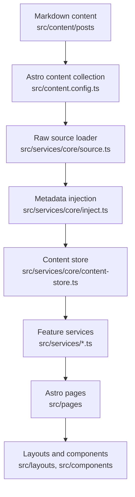

# Architecture

This project is a customized Mizuki-based static blog built with Astro, Svelte, Tailwind CSS, and Stylus. It is organized around a service layer so pages and components do not need to know the raw content implementation.

## Runtime Model

Astro builds the site statically. Content is loaded at build time through Astro content collections, transformed by `src/services/core`, and then passed into layouts and UI components.

## Key Directories

| Path | Purpose |
| --- | --- |
| `src/pages` | Astro routes and API-like static endpoints. Keep pages thin. |
| `src/layouts` | Page shell and grid layout composition. |
| `src/components` | Astro and Svelte UI components. |
| `src/services/core` | Content loading, sorting, derived metadata, taxonomy, and cached content store. |
| `src/services` | Feature-level data access for home, archive, categories, widgets, and post detail pages. |
| `src/content` | Astro content collections for posts and special pages. |
| `src/data` | Typed data for non-post pages such as timeline, diary, friends, projects, devices, and skills. |
| `src/utils` | Shared utility functions for URLs, dates, content, widgets, panels, and client behavior. |
| `public` | Static files copied directly to the built site. |
| `scripts` | Local automation for content sync, post creation, anime data, fonts, and search indexing support. |
| `docs` | Maintained project documentation. |

## Content Pipeline

1. `src/content.config.ts` defines the `posts` and `spec` content collections.
2. `getAllPostsRaw()` in `src/services/core/source.ts` reads posts from Astro content.
3. Draft filtering happens in `getAllPostsRaw()`:
   - Production: drafts are excluded.
   - Development: drafts are included.
4. `injectSystemMeta`, `injectListMeta`, and `injectNavigationMeta` enrich raw entries with stable metadata.
5. `buildContentStore()` creates the unified store:
   - `posts`
   - `categoryMap`
   - `categories`
6. Feature services and route handlers consume the store.

Use `getContentStore()` as the default data access point for post collections.

## Routing

Important routes:

| Route file | Responsibility |
| --- | --- |
| `src/pages/index.astro` | Home post list and category navigation. |
| `src/pages/posts/[...slug].astro` | Post detail pages generated by `buildPostDetailStaticPaths`. |
| `src/pages/[permalink].astro` | Custom permalink route support. |
| `src/pages/category/[slug]/index.astro` | First category page. |
| `src/pages/category/[slug]/page/[page].astro` | Category pagination. |
| `src/pages/archive.astro` | Archive page. |
| `src/pages/rss.xml.ts`, `src/pages/atom.xml.ts` | Feeds. |
| `src/pages/og/[...slug].png.ts` | Open Graph image generation when enabled. |

## Configuration

Primary configuration lives in `src/config.ts`. Its types live in `src/types/config.ts`.

High-impact configuration groups:

- `siteConfig`: site identity, language, feature pages, banners, typography, post list mode, feature switches.
- `navbarConfig`: top navigation.
- `profileConfig`: profile widget content.
- `sidebarLayoutConfig`: left/right sidebar behavior.
- `commentConfig`: comment provider settings.
- `permalinkConfig`: custom permalink strategy.

Document user-facing config changes in `docs/developers/configuration.md`.

## Extension Points

- Add content fields by editing `src/content.config.ts`, then update consumers in `src/services/core`.
- Add feature data through `src/data` when data is not post-like markdown content.
- Add widget components through `src/components/widget` and register them in `src/services/widget/registry.ts`.
- Add route-level behavior through `src/services` before wiring it into `src/pages`.

## Agent-Safe Change Strategy

- Start with service and type boundaries before editing UI.
- Keep generated data derivation in `src/services/core`.
- Do not duplicate category/tag URL logic; use `src/utils/url-utils.ts` and `src/utils/client-utils.ts`.
- Avoid direct content collection access outside the service layer unless the route is a specialized static endpoint.
