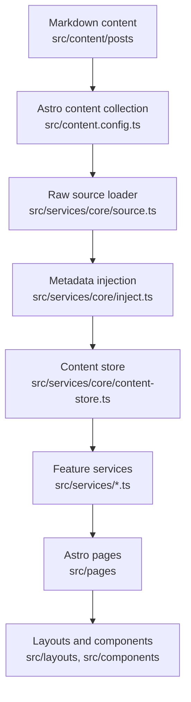

# Architecture

This project is a customized Mizuki-based static blog built with Astro, Svelte, Tailwind CSS, and Stylus. It is organized around a service layer so pages and components do not need to know the raw content implementation.

## Runtime Model

Astro builds the site statically. Content is loaded at build time through Astro content collections, transformed by `src/services/core`, and then passed into layouts and UI components.



## Key Directories

| Path | Purpose |
| --- | --- |
| `src/pages` | Astro routes and API-like static endpoints. Keep pages thin. |
| `src/layouts` | Page shell and grid layout composition. |
| `src/components` | Astro and Svelte UI components. |
| `src/design` | Sole owner of cross-feature visual tokens, themes, foundations, patterns, and legacy aliases. |
| `src/services/core` | Content loading, sorting, derived metadata, taxonomy, and cached content store. |
| `src/services` | Feature-level data access for home, archive, categories, feeds, calendar data, widgets, and post detail pages. |
| `src/content` | Astro content collections for posts and special pages. |
| `src/data` | Typed data for non-post pages such as timeline, diary, friends, projects, devices, and skills. |
| `src/utils` | Shared utility functions for URLs, dates, content, widgets, panels, and client behavior. |
| `public` | Static files copied directly to the built site. |
| `scripts` | Local automation for content sync, post creation, anime data, fonts, and search indexing support. |
| `docs` | Maintained project documentation. |

## Service and View Model Boundaries

Large file splitting should preserve the existing service-oriented architecture:

- `src/services/` owns page logic, build-time data adaptation, configuration normalization, static path builders, and page-level view models.
- `src/pages/` should stay thin. A route should call services, compose layouts/components, and pass view models into presentation components.
- `src/components/` and `src/layouts/` own rendering and local presentation. Page-specific extracted components should be mostly presentational.
- Runtime browser interaction state does not belong in `src/services/`. Keep DOM listeners, audio playback, pointer events, localStorage UI state, and Svelte runtime stores beside the owning component or feature.
- `src/services/core` remains the content pipeline boundary. Normal post collection data must continue to flow through `getContentStore()`.

Recommended split pattern for a thick route:

```text
src/pages/anime.astro
src/services/anime.ts
src/components/anime/
  AnimePage.astro
  AnimeToolbar.astro
  AnimeGrid.astro
  AnimeCard.astro
  types.ts
```

Recommended split pattern for a complex runtime feature:

```text
src/features/music-player/
  MusicPlayer.svelte
  MiniPlayer.svelte
  ExpandedPlayer.svelte
  PlaylistPanel.svelte
  audio-controller.ts
  storage.ts
  types.ts
```

Use feature-local helpers and types first. Promote code to `src/utils` or shared services only after multiple unrelated features reuse it.

The site notice is a shell-level feature rather than a Widget. `src/config/site-notice.ts` owns its configuration, `src/services/site-notice.ts` normalizes route visibility and builds the view model, and `src/components/site-notice` owns presentation and dismissal state. `MainGridContent.astro` renders it before the page Grid so it spans the shell without entering Desktop, Tablet, or Mobile Widget placement.

The home and category pages own separate page compositions while sharing Post Card and Grid contracts. Home renders six-post Recently Updated, Recommended, and Technology sections from `src/services/home.ts`; category pages render twelve-post pages with their taxonomy filter in the main content area. Astro produces SSG snapshots, while Svelte renders category tag-query pagination in the browser. Both renderers share the semantic class contract and styles in `src/features/post-list/post-list.css`; category runtime URL, history, filtering, and pagination behavior lives beside the category components in `src/components/category/category-page-client.ts`.

Listing pages use the fixed `listing` layout policy: three post columns plus a sidebar at `1536px` and above, two columns plus a sidebar from `768px`, and one column without a sidebar below `768px`. Home and category use separate Widget placements so only home renders Profile before content on Mobile.

Category listing and post-detail pages keep Banner geometry in Banner and Fullscreen modes but do not share home's Navbar state. Home alone uses `banner-aware` scroll behavior; category and post pages use a persistent `fixed-visible` Navbar. Normal and history visits in either retained-Banner mode align the actual `.page-main-content` region by subtracting its CSS `scroll-margin` clearance from its document coordinate. Browser history does not restore a cached Swup position: the Shell settles its Banner class without a `top` transition and applies the same page-owned coordinate before progress becomes idle. Hash, Overlay, and None visits preserve their page-policy behavior. Never derive this entry position from a live Banner rectangle or a transient navigation URL.

Post detail routes remain thin: `src/pages/posts/[...slug].astro` owns static path generation and forwards the page model to `src/components/post-detail/PostDetailPage.astro`. Header, last-modified status, navigation, and page-level styles live beside that presentation component. Runtime consumers may continue to rely on the stable `#post-container` and `.markdown-content` hooks.

`src/components/misc/Markdown.astro` is the single style entry for normal and encrypted post content. Shared Markdown, extended-content, and Expressive Code styles load there; encryption components own only protection and decrypted-state behavior. Code-copy interaction lives in `src/features/post-content/post-content-client.ts` rather than the presentation wrapper.

Route motion has one owner: `#swup-container` uses `.transition-swup-layout` for page changes. Navbar and Widget cards may keep their feature-specific entrance, and post-list items keep their intentional sequence; post-detail sections must not add nested generic entrance animations. A persistent Shell progress element consumes Swup lifecycle events and guarantees brief feedback even for cached navigation. `src/utils/page-lifecycle.ts` tracks the actual global Swup instance rather than a one-time boolean so replacement instances are rebound before later history visits.

## Design Layer Boundary

`src/design/` owns cross-feature visual decisions. Components consume Semantic tokens and `ds-` Pattern classes; route pages must not create new global color, typography, spacing, width, radius, shadow, or Surface systems. Primitive `--color-*` tokens are Design-only. Feature-local tokens may remain beside their component but should reference Semantic tokens. Detailed rules are owned by [Design System](../developers/design-system.md).

Legacy variables are one-way aliases from the Compatibility layer to Design tokens. New legacy consumption is rejected by `pnpm design:check`; existing debt is recorded in `scripts/design-system-baseline.json` and should only decrease.

## Content Pipeline

1. `src/content.config.ts` defines the `posts` and `spec` content collections.
2. `getAllPostsRaw()` in `src/services/core/source.ts` reads posts from Astro content.
3. Draft filtering happens in `getAllPostsRaw()`:
   - Production: drafts are excluded.
   - Development: drafts are included.
4. `injectSystemMeta`, `injectListMeta`, and `injectNavigationMeta` enrich raw entries with stable metadata.
5. `buildContentStore()` creates the unified store:
   - `posts`
   - `categoryMap`
   - `categories`
6. Feature services and route handlers consume the store. Feed and calendar endpoints should use `src/services/feed.ts` and `src/services/calendar.ts` instead of querying Astro content directly.

Use `getContentStore()` as the default data access point for post collections.

## Routing

Important routes:

| Route file | Responsibility |
| --- | --- |
| `src/pages/index.astro` | Home content sections backed by `src/services/home.ts`. |
| `src/pages/posts/[...slug].astro` | Post detail pages generated by `buildPostDetailStaticPaths`. |
| `src/pages/category/[slug]/index.astro` | First category page backed by `src/services/category-page.ts`. |
| `src/pages/category/[slug]/page/[page].astro` | Category pagination backed by `src/services/category-page.ts`. |
| `src/pages/archive.astro` | Archive page. |
| `src/pages/rss.xml.ts`, `src/pages/atom.xml.ts` | Feeds backed by `src/services/feed.ts`. |
| `src/pages/og/[...slug].png.ts` | Open Graph image generation when enabled. |

## Configuration

Primary configuration lives in modules under `src/config/`. The file `src/config.ts` is a compatibility export entry so existing imports from `@/config` and relative `../config` paths continue to work. Its types live in `src/types/config.ts`.

High-impact configuration groups:

- `siteConfig`: site identity, language, feature pages, banners, typography, post list mode, feature switches.
- `navBarConfig`: top navigation.
- `profileConfig`: profile widget content.
- `pageLayoutPolicies`: responsive page regions and the desktop layouts each page permits.
- `widgetPlacementPresets`: explicit widgets for each viewport and region; no cross-viewport migration is inferred.
- `commentConfig`: comment provider settings.

When adding or changing configuration values, edit the nearest module under `src/config/` instead of expanding `src/config.ts`. Document user-facing config changes in `docs/developers/configuration.md`.

## Extension Points

- Add content fields by editing `src/content.config.ts`, then update consumers in `src/services/core`.
- Add feature data through `src/data` when data is not post-like markdown content.
- Add widget components through `src/components/widget` and register them in `src/services/widget/registry.ts`.
- Add route-level behavior through `src/services` before wiring it into `src/pages`.

## Agent-Safe Change Strategy

- Start with service and type boundaries before editing UI.
- Keep generated data derivation in `src/services/core`.
- All architectural changes must respect the `src/services/core` pipeline.
- Do not bypass the `content-store` layer for normal post collection data.
- Do not duplicate category, tag, or post URL logic; use `src/utils/url-utils.ts` and `src/utils/client-utils.ts`.
- Avoid direct content collection access outside the service layer unless the route is a specialized static endpoint.
