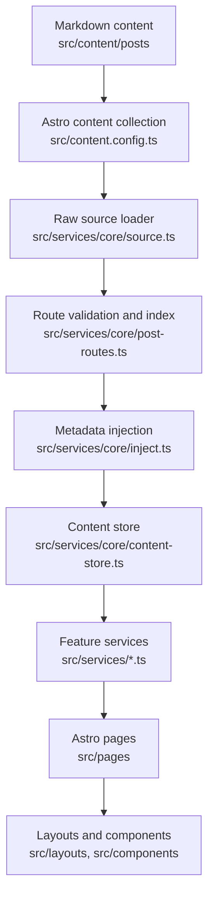

# Architecture

This project is a customized Mizuki-based static blog built with Astro, Svelte, Tailwind CSS, and Stylus. It is organized around a service layer so pages and components do not need to know the raw content implementation.

## Runtime Model

Astro builds the site statically. Content is loaded at build time through Astro content collections, transformed by `src/services/core`, and then passed into layouts and UI components.

Before development or build entrypoints start Astro, `pnpm content:prepare` selects the content source. Local mode leaves repository content untouched. External mode fetches one required commit SHA into staging, validates `posts`, `spec`, `data`, and `images`, promotes an immutable release, and switches the single `CONTENT_DIR/current` pointer. External preparation failures stop the command; they never fall back to local or stale content.



## Key Directories

| Path | Purpose |
| --- | --- |
| `src/pages` | Astro routes and API-like static endpoints. Keep pages thin. |
| `src/layouts` | Page shell and grid layout composition. |
| `src/components` | Astro and Svelte UI components. |
| `src/design` | Sole owner of cross-feature visual tokens, themes, foundations, patterns, and legacy aliases. |
| `src/services/core` | Content loading, sorting, derived metadata, taxonomy, and cached content store. |
| `src/services` | Feature-level data access for home, archive, categories, feeds, footer statistics, calendar data, and post detail pages. |
| `src/content` | Astro content collections for posts and special pages. |
| `src/data` | Typed data for non-post pages such as timeline, diary, friends, projects, devices, and skills. |
| `src/utils` | Shared utility functions for URLs, dates, content, panels, and client behavior. |
| `public` | Static files copied directly to the built site. |
| `scripts` | Local automation for content sync, post creation, anime data, fonts, and search indexing support. |
| `docs` | Maintained project documentation. |

## Service and View Model Boundaries

Large file splitting should preserve the existing service-oriented architecture:

- `src/services/` owns page logic, build-time data adaptation, configuration normalization, static path builders, and page-level view models.
- `src/pages/` should stay thin. A route should call services, compose layouts/components, and pass view models into presentation components.
- `src/components/` and `src/layouts/` own rendering and local presentation. Page-specific extracted components should be mostly presentational.
- Runtime browser interaction state does not belong in `src/services/`. Keep DOM listeners, audio playback, pointer events, localStorage UI state, and Svelte runtime stores beside the owning component or feature.
- `src/services/core` remains the content pipeline boundary. Normal post collection data must continue to flow through `getContentStore()`.

Recommended split pattern for a thick route:

```text
src/pages/anime.astro
src/services/anime.ts
src/components/anime/
  AnimePage.astro
  AnimeToolbar.astro
  AnimeGrid.astro
  AnimeCard.astro
  types.ts
```

Recommended split pattern for a complex runtime feature:

```text
src/features/music-player/
  MusicPlayer.svelte
  MiniPlayer.svelte
  ExpandedPlayer.svelte
  PlaylistPanel.svelte
  audio-controller.ts
  storage.ts
  types.ts
```

Use feature-local helpers and types first. Promote code to `src/utils` or shared services only after multiple unrelated features reuse it.

The site notice is an independent shell feature. `src/config/site-notice.ts` owns its configuration, `src/services/site-notice.ts` normalizes route visibility and builds the view model, and `src/components/site-notice` owns the top-right preview presentation. `src/features/activity-center/notice-state.ts` owns separate read and dismissal persistence. Informational and success previews retire after a short interval while remaining available in Activity Center; warning and danger previews remain persistent. `MainGridContent.astro` renders the preview before the page Grid.

Activity Center is the Navbar-level information hub mounted at the top right. `src/features/activity-center` composes site-notice history with browser-only article reading status (progress, current heading, remaining time, and a saved resume position). Its notification badge represents unread notices only; its ring represents reading progress only. Do not add action shortcuts here—viewport actions belong to Floating Tools.

Shell icons added by Activity Center and Floating Tools are repository assets under `src/assets/icons/material-symbols`. `src/components/ui/local-icons.ts` is the explicit registry consumed by the Astro and Svelte `LocalIcon` renderers. New icons in these Shell features must be downloaded and registered there; do not introduce runtime Iconify API dependencies. An unregistered dynamic notice icon falls back to the local information icon in Activity Center.

Floating Tools is a Shell-level interaction feature mounted by `MainGridContent.astro` outside the animated Main Content Layer. `src/features/floating-tools` owns the bottom-right rail, responsive placement, and expansion state; Theme, Music, Settings, Floating TOC, and Back to Top retain their existing feature behavior and are composed into that rail. Settings is a viewport-bounded popover on desktop and a bottom sheet on mobile. Fixed-position controls must not be nested under transformed route containers or reintroduce independent viewport coordinates outside the Floating Tools placement owner.

Pio availability remains configuration-owned while `src/features/pio/preferences.ts` owns the visitor visibility preference and event contract. Music Player owns Audio, activation, and expanded geometry. `src/features/music-player/events.ts` is the narrow UI contract used by Floating Tools to request the panel and consume playing/loading/started/expanded state. Before first playback the Hidden fallback opens the Expanded Player; after activation it restores the Mini Player directly while the Floating Tools Music entry continues to toggle the Expanded Player. Hidden and Mini share a bottom-right anchored morph: Mini collapses into the fallback, while the fallback travels to the Mini cover position during restoration before the real cover takes over. Floating Tools consumes explicit state and layout events rather than inspecting Music Player DOM mutations.

Page modules own their placement. Home passes one `ProfileCard` through `MainGridLayout`'s named `support` slot; the same DOM node appears before content below `880px` and in the right column from `880px`. Category and post-detail pages are content-only. Archive owns Calendar, Categories, and Tags in its main flow. Site statistics are a Footer feature: `src/services/footer.ts` builds the view model from content-store metadata and `src/components/footer` renders it once. Footer height remains content-driven, with its outer, Stats, and Meta spacing owned by Footer-local tokens rather than a fixed Shell height. `PanelCard.astro` is only a visual container and must not become a placement registry.

The home and category pages own separate page compositions while sharing Post Card and Grid contracts. Home renders Recently Updated and Recommended sections with six-post limits; its optional Technology section selects only the canonical `tech` taxonomy, ranks that category by score, never backfills from another category, and disappears when empty. Category pages render twelve-post pages with their taxonomy filter in the main content area. Category SSG props retain only the current page and data-free pagination metadata. Each category also emits one compact `/api/categories/{slug}.json/` index. After the initial page load, Svelte prefetches that index during browser idle time only while the page is visible, online, outside `Save-Data`, and above 2g; a valid Tag query always loads immediately even when prefetch was skipped. The module cache is keyed by the complete index URL, shares promises across prefetch, Tag pagination, history, and Tag changes, and retains at most three recently used category indexes. Prefetch does not mutate component state, and request-version checks prevent an obsolete response from updating the active view. Both renderers share the semantic class contract and styles in `src/features/post-list/post-list.css`; its Card block size also owns the matching intrinsic placeholder, while cover ratio and Feed width breakpoints remain independent inline-size contracts. Category runtime URL, request state, history, filtering, and pagination behavior lives beside the category components in `src/components/category/category-page-client.ts`.

Home, category, and post-detail pages use the `container-content` strategy. Banner always remains viewport-wide, while Navbar and Main Shell share a `1280px` outer maximum width. Home uses a maximum `992px` three-column Feed plus a `248px–272px` support column from `1200px`, a maximum `656px` two-column Feed plus support from `880px`, full-width Profile before two Feed columns from `608px`, and one Feed column below that. The Feed enters three columns at `932px`; the resulting Grid Cards target about `320px` while retaining `296px` as the safe minimum. Category and post-detail pages have no support column: their content maximum is `656px` below `1200px` and `992px` from `1200px`; post content keeps its narrower reading measure internally. Legacy pages without support center at `--width-listing`. These pages clear the legacy root-font `pageScaling`; viewport Grid rules live in `page-grid-legacy.css` and must remain scoped away from `container-content`. The shared `--navbar-shell-height` drives the Navbar outer height, Main Content offset, Page Entry clearance, Site Notice position, and runtime scroll thresholds; Navigation controls keep their independent `44px` target. The post TOC derives its external rail from `--width-shell-wide` rather than the legacy `--page-width` formula.

Page Layout Policy, Desktop Page Layout Preference, and Post List View Mode are separate contracts. Policy selects the responsive Shell Strategy and constrains allowed page compositions; Desktop preference chooses only within that allowed set; Post List View Mode changes only list-versus-grid presentation and must not write the page preference.

Category listing and post-detail pages keep Banner geometry in Banner and Fullscreen modes but do not share home's Navbar state. Home alone uses `banner-aware` scroll behavior; category and post pages use a persistent `fixed-visible` Navbar. Normal and history visits in either retained-Banner mode align the actual `.page-main-content` region by subtracting its CSS `scroll-margin` clearance from its document coordinate. Browser history does not restore a cached Swup position: the Shell settles its Banner class without a `top` transition and applies the same page-owned coordinate before progress becomes idle. Hash, Overlay, and None visits preserve their page-policy behavior. Never derive this entry position from a live Banner rectangle or a transient navigation URL.

Post detail routes remain thin: `src/pages/posts/[...slug].astro` owns static path generation and forwards the page model to `src/components/post-detail/PostDetailPage.astro`. Header, last-modified status, navigation, and page-level styles live beside that presentation component. Runtime consumers may continue to rely on the stable `#post-container` and `.markdown-content` hooks. `#post-container` also exposes normalized reading title and minute metadata for Activity Center; scroll state remains browser-local beside that feature.

`src/components/misc/Markdown.astro` is the single style entry for normal and encrypted post content. Shared Markdown, extended-content, and Expressive Code styles load there; encryption components own only protection and decrypted-state behavior. Code-copy interaction lives in `src/features/post-content/post-content-client.ts` rather than the presentation wrapper.

Route motion has one owner: `#swup-container` uses `.transition-swup-layout` for page changes. Navbar and page modules may keep meaningful feature-specific entrance effects, and post-list items keep their intentional sequence; post-detail sections must not add nested generic entrance animations. A persistent Shell progress element consumes Swup lifecycle events and guarantees brief feedback even for cached navigation. `src/utils/page-lifecycle.ts` tracks the actual global Swup instance rather than a one-time boolean so replacement instances are rebound before later history visits.

## Design Layer Boundary

`src/design/` owns cross-feature visual decisions. Components consume Semantic tokens and `ds-` Pattern classes; route pages must not create new global color, typography, spacing, width, radius, shadow, or Surface systems. Primitive `--color-*` tokens are Design-only. Feature-local tokens may remain beside their component but should reference Semantic tokens. Detailed rules are owned by [Design System](../developers/design-system.md).

Legacy variables are one-way aliases from the Compatibility layer to Design tokens. New legacy consumption is rejected by `pnpm design:check`; existing debt is recorded in `scripts/design-system-baseline.json` and should only decrease.

## Content Pipeline

Content preparation and content transformation are separate boundaries. `scripts/content-sync/` owns Git, staging, release validation, managed links, and source activation. It must invoke Git with argument arrays and `shell: false`; no URL or credential-bearing command may be logged. `src/services/core` begins only after the selected filesystem content is stable.

1. `src/content.config.ts` defines the `posts` and `spec` content collections.
2. `getAllPostsRaw()` in `src/services/core/source.ts` reads posts from Astro content.
3. Draft filtering happens in `getAllPostsRaw()`:
   - Production: drafts are excluded.
   - Development: drafts are included.
4. `validatePostRoutes()` validates all published post routes before content rendering, then `buildPostRouteIndex()` creates the immutable ID, canonical-slug, and URL indexes.
5. `buildPostIndexEntries()` reads list statistics from Astro's prepared `entry.rendered.metadata`, resolves taxonomy, score, cover, and navigation data, and produces body-free `PostIndexEntry` values.
6. Post Index construction returns both body-free entries and the authoritative `PostRouteIndex`. `buildContentStore()` preserves that exact route-index identity and rejects missing, mismatched, or independently reconstructed route entries. It retains only the lightweight post index, ID and route indexes, taxonomy, and aggregate statistics; it never stores raw Markdown bodies, rendered HTML, passwords, or detail-only frontmatter.
   Known category names and aliases are canonicalized before this boundary. The canonical technology taxonomy is `技术` / `tech`; `Technology` is accepted only as an input alias and never owns a separate route.
7. `getContentStore()` caches the in-flight Promise so concurrent first callers share one initialization. Rejected initialization and Vite HMR disposal clear the cache.
8. Post detail static paths contain only canonical slugs and post IDs. The detail service fetches the raw entry on demand, builds a UI-ready detail view model, and shares a bounded, failure-evicting `Map<id, Promise<RenderedPost>>` render registry.
9. Category Tag endpoints map the index to compact `ClientPostCard` values. Default category pages never serialize or download a complete category.
10. Feed maps body-free indexes to a shared `FeedItemViewModel` with `description || excerpt || title` summaries. RSS and Atom never fetch RawPost or render Markdown; the Atom serializer escapes XML text and attributes explicitly.

Use `getContentStore()` as the default data access point for post indexes. Raw entries are detail/feed build inputs and must stay behind their owning service boundary.

Route derivation is a build-time service responsibility. A post with an alias generates only its alias-backed canonical page; its filename route is intentionally absent. Feature services must consume `ContentStore.routes` or a page view model instead of reconstructing a post URL. UI components receive final `url`, `canonicalUrl`, and navigation links and must not parse aliases, entry IDs, or slugs.

## Routing

Important routes:

| Route file | Responsibility |
| --- | --- |
| `src/pages/index.astro` | Home content sections backed by `src/services/home.ts`. |
| `src/pages/posts/[...slug].astro` | Post detail pages generated by `buildPostDetailStaticPaths`. |
| `src/pages/category/[slug]/index.astro` | Canonical first category page backed by `src/services/category-page.ts`. |
| `src/pages/category/[slug]/page/[page].astro` | Category pagination from page 2 onward; page 1 is intentionally absent. |
| `src/pages/api/categories/[slug].json.ts` | Compact per-category Tag index loaded by conditional idle prefetch or immediately by Tag mode. |
| `src/pages/archive.astro` | Archive page. |
| `src/pages/rss.xml.ts`, `src/pages/atom.xml.ts` | Feeds backed by `src/services/feed.ts`. |
| `src/pages/og/[...slug].png.ts` | Open Graph image generation when enabled. |

## Configuration

Primary configuration lives in modules under `src/config/`. The file `src/config.ts` is a compatibility export entry so existing imports from `@/config` and relative `../config` paths continue to work. Its types live in `src/types/config.ts`.

High-impact configuration groups:

- `siteConfig`: site identity, language, feature pages, banners, typography, post list mode, feature switches.
- `navBarConfig`: top navigation.
- `profileConfig`: homepage author profile content.
- `pageLayoutPolicies`: responsive shell strategy and the desktop layouts each page permits. Current policies allow only `content-right`.
- `commentConfig`: comment provider settings.

When adding or changing configuration values, edit the nearest module under `src/config/` instead of expanding `src/config.ts`. Document user-facing config changes in `docs/developers/configuration.md`.

## Extension Points

- Add content fields by editing `src/content.config.ts`, then update consumers in `src/services/core`.
- Add feature data through `src/data` when data is not post-like markdown content.
- Add page modules to the owning domain directory and compose them explicitly in the route or layout. Do not recreate a generic placement registry for page-specific content.
- Add route-level behavior through `src/services` before wiring it into `src/pages`.

## Agent-Safe Change Strategy

- Start with service and type boundaries before editing UI.
- Keep generated data derivation in `src/services/core`.
- All architectural changes must respect the `src/services/core` pipeline.
- Do not bypass the `content-store` layer for normal post collection data.
- Do not duplicate category or tag URL logic; use the existing URL helpers. Post URLs must come from `ContentStore.routes` or build-time view models.
- Avoid direct content collection access outside the service layer unless the route is a specialized static endpoint.
