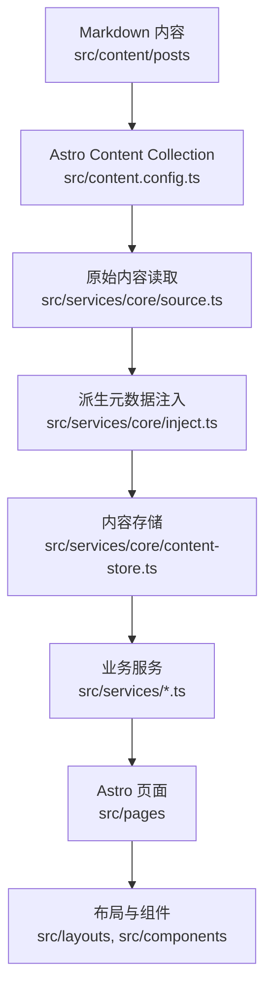

# 项目架构

本项目是基于 Mizuki 深度定制的 Astro + Svelte 静态博客。当前改造目标是让页面、内容、配置和 Agent 协作边界清晰可维护。

## 运行模型

Astro 在构建期读取 Markdown 内容，通过 `src/services/core` 生成统一内容存储，再交给页面、布局和组件渲染。



## 核心目录

| 路径 | 说明 |
| --- | --- |
| `src/pages` | Astro 路由和静态端点。页面应尽量保持轻量。 |
| `src/layouts` | 页面外壳和网格布局。 |
| `src/components` | Astro 与 Svelte UI 组件。 |
| `src/design` | 跨功能视觉规则的唯一所有者：token、Theme、Foundation、Pattern 与 Legacy 兼容。 |
| `src/services/core` | 内容读取、排序、派生元数据、分类标签索引、内容缓存。 |
| `src/services` | 首页、归档、分类、Feed、日历数据、组件、文章详情等业务服务。 |
| `src/content` | Astro 内容集合，包含文章和特殊页面。 |
| `src/data` | 时间线、日记、友链、项目、设备、技能等非文章数据。 |
| `src/utils` | URL、日期、内容处理、组件和客户端行为工具。 |
| `public` | 构建时原样复制的静态资源。 |
| `scripts` | 内容同步、文章创建、番剧数据、字体压缩、索引提交等脚本。 |
| `docs` | 项目文档，按开发者和 Agent 分区维护。 |

## 服务层与 View Model 边界

后续拆分大文件时，应继续沿用当前的逻辑与页面解耦方案：`src/services/` 承载页面逻辑和 view model，`src/pages/` 保持路由入口轻量，拆出来的页面组件尽量只负责展示。

推荐边界如下：

- `src/services/` 负责页面逻辑、数据适配、配置归一化、static paths 构建、页面级 view model 生成。
- `src/pages/` 只负责路由入口：调用 service、组合 layout/component、把 view model 传给展示组件。
- `src/components/` 与 `src/layouts/` 负责渲染和局部展示结构。由页面拆出的组件应尽量是 presentational component。
- 浏览器运行时交互不放入 `src/services/`，例如 DOM 监听、音频播放、pointer/mouse/touch 事件、localStorage UI 状态、Svelte runtime store，应放在所属组件或 feature 目录旁边。
- `src/services/core` 仍然是内容管线边界。普通文章集合、分类、标签、归档和文章详情数据不要绕过 `getContentStore()`。

厚页面推荐拆分方式：

```text
src/pages/anime.astro
src/services/anime.ts
src/components/anime/
  AnimePage.astro
  AnimeToolbar.astro
  AnimeGrid.astro
  AnimeCard.astro
  types.ts
```

复杂运行时功能推荐使用 feature-local 结构：

```text
src/features/music-player/
  MusicPlayer.svelte
  MiniPlayer.svelte
  ExpandedPlayer.svelte
  PlaylistPanel.svelte
  audio-controller.ts
  storage.ts
  types.ts
```

拆分时优先把 helper 和类型留在所属功能目录内。只有当多个无关功能都复用同一段逻辑时，才提升到共享的 `src/utils` 或通用 service。

首页与分类页使用独立页面组合，并共享 Post Card 与 Grid 契约。首页由 `src/services/home.ts` 依次输出最近更新、推荐阅读、技术文章三个区块，每组 6 篇；分类页每页 12 篇，并在主内容顶部拥有分类与 Tag 筛选器。Astro 输出 SSG 快照，带 Tag 查询参数时由 Svelte 在浏览器端渲染分页结果；查询参数、history、过滤和客户端分页逻辑与分类组件共置在 `src/components/category/category-page-client.ts`。

首页、分类页与文章详情页使用 `container-content` 布局策略，不再根据 viewport 猜测主内容剩余宽度。Banner 始终铺满 viewport，Navbar、Main Shell 与三列 Main Grid 使用统一的 `1352px` 外部最大宽度；Shell 通过收缩自身外宽保留响应式安全 margin，内部不再追加左右 padding。Page Shell 通过四个稳定状态退让：`1200px` 以上为三列 Feed + `248px–272px` Sidebar；`880px–1199px` 为双列 Feed + 同一 Sidebar；`608px–879px` 隐藏 Sidebar 并把其 Widget 放到 Main 前方，Feed 维持双列；更窄时 Feed 退为单列。双列与无 Sidebar Main Grid 最大宽度分别为 `992px` 和 `704px`，双列与三列 Card 使用约 `296px–344px` 的稳定宽度区间，单列最大 `400px`。Sidebar 显示端点与双列 Feed 最小预算绑定，任何带右侧 Sidebar 的状态都至少保留两列文章，且 Supporting Row 与 Desktop Sidebar 必须互斥。首页、分类页和文章详情页都为前置 Supporting Row 提供与 Sidebar 对应的 Widget；Page Layout Policy 决定 Supporting Row 使用单列填充、固定双列或自动 Grid，Widget 自身再根据 Slot 宽度决定内部排列。进入 Mobile 后继续使用各页面已有的 Mobile placement。旧 viewport Grid 已隔离到 `page-grid-legacy.css`，不得重新覆盖 `container-content` 状态。

`container-content` 页面会停用旧 `pageScaling` 根字号缩放，避免在 1280px 附近同时存在 px Shell 预算和 rem 全局缩放。文章 Sidebar TOC 也从 `--width-shell-wide` 推导外侧 Rail；只有 viewport 能容纳完整 Shell 与 TOC 时才显示，否则使用已有的窄屏 TOC 入口。

分类页与文章详情页在 Banner 与 Fullscreen 模式下保留横幅几何，但 Navbar 行为与首页解耦：只有首页使用 `banner-aware` 的透明度/滚动状态，分类页与文章详情页使用始终可见的 `fixed-visible` 状态。这两种模式的普通导航以及浏览器前进/后退都直接定位实际的 `.page-main-content` 区域，以其文档坐标减去 CSS `scroll-margin` clearance 得出统一位置，不再维护额外的零高度锚点；Overlay、None 和 Hash 导航不执行该定位。页面身份取自新容器的 interaction policy，不依赖内容替换阶段的瞬时 URL。

`main-grid-client` 是 Banner 可见性与 `content-start` 滚动的唯一 runtime owner。普通分类/文章链接在 `content:replace` 后执行一次 `380ms` Shell 自管 easing 动画；浏览器 history 只在 settled 阶段执行 instant 精确校正。动画可被滚轮、触摸、指针和滚动按键中断，并在 `prefers-reduced-motion` 下退化为即时定位。旧的 `layout-client` 只为未声明 `content-start` 的页面执行回到顶部，不再重复添加移动端 Banner 隐藏 class。

页面切换不再使用固定 `300vh` 扩展高度。Shell 在 `visit:start` 记录旧页面 `scrollHeight`，在 `content:replace` 后只为更短的新页面补充精确高度差，并在入口动画或 history 校正完成后以短过渡释放 `PageHeightGuard`。Grid Card 的 `contain-intrinsic-size` 与固定 `29rem` 高度一致，避免离屏行进入渲染范围时再次修改文档总高度。

Shell 自有的顶部 Navigation Progress 使用 Semantic `--accent` 与 Motion token 表达 Swup 请求和替换状态。它从 `visit:start` 开始、在 `content:replace` 推进并于 `visit:end` 完成，快速导航也保留最短可见时间。历史访问禁用 Swup 的缓存位置恢复，并在 settled 阶段临时关闭内容层 `top` transition、同步 Banner class、完成语义入口定位后才发布 `idle`。进度条不占布局高度，也不等待图片、统计、搜索或 Svelte hydration 完成。

文章详情路由保持轻量：`src/pages/posts/[...slug].astro` 负责 static paths 并把页面模型转交给 `src/components/post-detail/PostDetailPage.astro`。Header、最后修改时间、上下篇导航和页面级样式与展示组件放在同一 feature 目录；TOC 等运行时消费者继续使用稳定的 `#post-container` 与 `.markdown-content` hook。

`src/components/misc/Markdown.astro` 是普通文章与加密文章共用的唯一内容样式入口，统一加载 Markdown、扩展内容和 Expressive Code 样式；加密组件只负责保护与解密状态。代码复制交互位于 `src/features/post-content/post-content-client.ts`，不再混入展示容器。

路由切换动画由 `#swup-container` 的 `.transition-swup-layout` 单点负责。Navbar、Widget 卡片可以保留各自有意义的入场效果，文章列表项保留序列动画；文章详情内部区块不再叠加通用入场动画，避免嵌套位移和重复延迟。

## 内容管线

1. `src/content.config.ts` 定义 `posts` 和 `spec` 内容集合。
2. `src/services/core/source.ts` 中的 `getAllPostsRaw()` 从 Astro Content Collection 读取文章。
3. 草稿过滤在 `getAllPostsRaw()` 中完成：
   - 开发环境包含草稿。
   - 生产环境排除 `draft: true` 的文章。
4. `injectSystemMeta`、`injectListMeta`、`injectNavigationMeta` 为文章注入系统元数据、摘要、阅读时间和上下篇导航。
5. `buildContentStore()` 生成统一内容存储：
   - `posts`
   - `categoryMap`
   - `categories`
6. 页面和业务服务优先消费 `getContentStore()`。Feed 与日历端点应通过 `src/services/feed.ts`、`src/services/calendar.ts` 取数，不直接查询 Astro Content Collection。

## 路由说明

| 路由文件 | 说明 |
| --- | --- |
| `src/pages/index.astro` | 首页文章列表和分类导航。 |
| `src/pages/posts/[...slug].astro` | 文章详情页，由 `buildPostDetailStaticPaths` 生成路径。 |
| `src/pages/category/[slug]/index.astro` | 分类第一页，底层由 `src/services/category-page.ts` 生成页面数据。 |
| `src/pages/category/[slug]/page/[page].astro` | 分类分页，底层由 `src/services/category-page.ts` 生成页面数据。 |
| `src/pages/archive.astro` | 归档页。 |
| `src/pages/rss.xml.ts`、`src/pages/atom.xml.ts` | Feed 输出，底层由 `src/services/feed.ts` 提供数据与内容渲染。 |
| `src/pages/og/[...slug].png.ts` | Open Graph 图片生成。 |

## 配置入口

主要配置位于 `src/config.ts`，类型位于 `src/types/config.ts`。

高影响配置包括：

- `siteConfig`：站点信息、语言、特色页面、横幅、主题、字体、文章列表行为。
- `navbarConfig`：顶部导航。
- `profileConfig`：个人资料组件。
- `pageLayoutPolicies`：页面在 Desktop、Tablet、Mobile 下的区域结构，以及允许的桌面布局偏好。
- `widgetPlacementPresets`：各端点、各区域中显式渲染的 Widget；端点之间不继承、不迁移。
- `commentConfig`：评论系统。

配置结构变化需要同步更新 [配置说明](./configuration.md)。

## 扩展原则

- 新增文章字段：先改 `src/content.config.ts`，再改 `src/services/core` 的派生逻辑。
- 新增非文章数据：优先放到 `src/data`。
- 新增 Widget：放入 `src/components/widget`，在 `src/services/widget/registry.ts` 注册，并在 `src/services/widget/presets.ts` 中按端点和区域显式配置。
- 网站级通知不属于 Widget。`src/config/site-notice.ts` 拥有配置，`src/services/site-notice.ts` 生成 View Model，`src/components/site-notice` 拥有呈现与关闭状态交互，并通过独立的 `#site-notice-container` 在主内容 Shell 中更新。通知不得放进带 `transform` 的 `#swup-container`，否则固定定位会在过渡期间改用内容容器作为 containing block。Desktop/Tablet 通知使用贴近 viewport 右上角的单行状态卡，层级低于 Navbar 与交互浮层；Mobile 则限制在页面安全边距内并允许两行正文。通知 viewport 高度按断点固定，轮播不得在客户端按单条内容重新测量高度，因此通知切换不会改变文档 `scrollHeight` 或滚动条比例。
- 新增页面逻辑：先封装到 `src/services`，再接入 `src/pages`。
- 分类、标签和文章 URL 不要硬编码，使用 `src/utils/url-utils.ts` 和 `src/utils/client-utils.ts`。

## 首页与文章视觉基础

首页和文章详情页通过 `src/design/` 统一 Surface、文本层级、内容宽度、页面间距与 Typography。其他功能页仍可通过 Legacy token 保持兼容，详细分层和迁移规则见 [Design System](./design-system.md)。

- 首页文章列表使用 `--width-listing`，不随主内容列无限扩张。
- 文章正文阅读宽度使用 `--width-reading: 48rem`；代码、表格、图片与数学公式可扩展到 `--width-reading-wide`。
- 普通模式下文章正文使用无卡片背景的 Content Surface；壁纸透明或 Overlay 模式仍使用半透明背景、轻边框与 blur，以维持可读性。
- 首页和文章详情页优先消费 `--surface-*`、`--text-*`、`--border-*` 与 `--accent` 等 Semantic token。旧的 `--card-bg`、`--primary`、`--line-*` 等变量由 Compatibility 层供值，不应在新代码中继续扩散。
- 页面级留白使用 `--space-page-x`、`--space-content` 与 `--space-cluster`；组件内部的小型布局仍可使用 Tailwind spacing utility。

Design 层不拥有具体 Feature 动画、浏览器交互或第三方库主题；这些规则继续由所属 Feature 管理。
