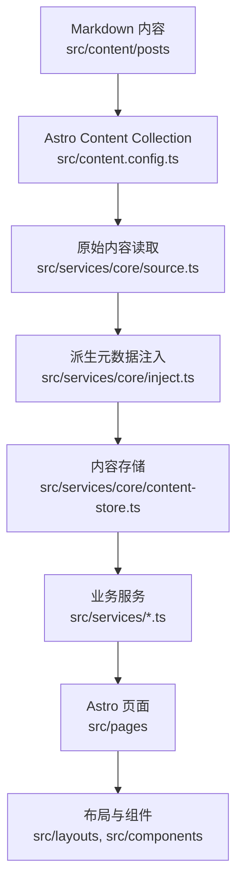

# 项目架构

本项目是基于 Mizuki 深度定制的 Astro + Svelte 静态博客。当前改造目标是让页面、内容、配置和 Agent 协作边界清晰可维护。

## 运行模型

Astro 在构建期读取 Markdown 内容，通过 `src/services/core` 生成统一内容存储，再交给页面、布局和组件渲染。



## 核心目录

| 路径 | 说明 |
| --- | --- |
| `src/pages` | Astro 路由和静态端点。页面应尽量保持轻量。 |
| `src/layouts` | 页面外壳和网格布局。 |
| `src/components` | Astro 与 Svelte UI 组件。 |
| `src/services/core` | 内容读取、排序、派生元数据、分类标签索引、内容缓存。 |
| `src/services` | 首页、归档、分类、Feed、日历数据、组件、文章详情等业务服务。 |
| `src/content` | Astro 内容集合，包含文章和特殊页面。 |
| `src/data` | 时间线、日记、友链、项目、设备、技能等非文章数据。 |
| `src/utils` | URL、日期、内容处理、组件和客户端行为工具。 |
| `public` | 构建时原样复制的静态资源。 |
| `scripts` | 内容同步、文章创建、番剧数据、字体压缩、索引提交等脚本。 |
| `docs` | 项目文档，按开发者和 Agent 分区维护。 |

## 服务层与 View Model 边界

后续拆分大文件时，应继续沿用当前的逻辑与页面解耦方案：`src/services/` 承载页面逻辑和 view model，`src/pages/` 保持路由入口轻量，拆出来的页面组件尽量只负责展示。

推荐边界如下：

- `src/services/` 负责页面逻辑、数据适配、配置归一化、static paths 构建、页面级 view model 生成。
- `src/pages/` 只负责路由入口：调用 service、组合 layout/component、把 view model 传给展示组件。
- `src/components/` 与 `src/layouts/` 负责渲染和局部展示结构。由页面拆出的组件应尽量是 presentational component。
- 浏览器运行时交互不放入 `src/services/`，例如 DOM 监听、音频播放、pointer/mouse/touch 事件、localStorage UI 状态、Svelte runtime store，应放在所属组件或 feature 目录旁边。
- `src/services/core` 仍然是内容管线边界。普通文章集合、分类、标签、归档和文章详情数据不要绕过 `getContentStore()`。

厚页面推荐拆分方式：

```text
src/pages/anime.astro
src/services/anime.ts
src/components/anime/
  AnimePage.astro
  AnimeToolbar.astro
  AnimeGrid.astro
  AnimeCard.astro
  types.ts
```

复杂运行时功能推荐使用 feature-local 结构：

```text
src/features/music-player/
  MusicPlayer.svelte
  MiniPlayer.svelte
  ExpandedPlayer.svelte
  PlaylistPanel.svelte
  audio-controller.ts
  storage.ts
  types.ts
```

拆分时优先把 helper 和类型留在所属功能目录内。只有当多个无关功能都复用同一段逻辑时，才提升到共享的 `src/utils` 或通用 service。

文章列表有意保留两个轻量 renderer：主页与分类页的 SSG 快照由 Astro 输出，分类页带 Tag 查询参数时由 Svelte 在浏览器端渲染分页结果。两种 renderer 统一使用 `src/features/post-list/post-list.css` 中的语义 class contract；Svelte 版本只通过 feature controller 将动态挂载的列表同步到全局布局偏好，不再重复注册布局事件。

文章详情路由保持轻量：`src/pages/posts/[...slug].astro` 负责 static paths 并把页面模型转交给 `src/components/post-detail/PostDetailPage.astro`。Header、最后修改时间、上下篇导航和页面级样式与展示组件放在同一 feature 目录；TOC 等运行时消费者继续使用稳定的 `#post-container` 与 `.markdown-content` hook。

`src/components/misc/Markdown.astro` 是普通文章与加密文章共用的唯一内容样式入口，统一加载 Markdown、扩展内容和 Expressive Code 样式；加密组件只负责保护与解密状态。代码复制交互位于 `src/features/post-content/post-content-client.ts`，不再混入展示容器。

## 内容管线

1. `src/content.config.ts` 定义 `posts` 和 `spec` 内容集合。
2. `src/services/core/source.ts` 中的 `getAllPostsRaw()` 从 Astro Content Collection 读取文章。
3. 草稿过滤在 `getAllPostsRaw()` 中完成：
   - 开发环境包含草稿。
   - 生产环境排除 `draft: true` 的文章。
4. `injectSystemMeta`、`injectListMeta`、`injectNavigationMeta` 为文章注入系统元数据、摘要、阅读时间和上下篇导航。
5. `buildContentStore()` 生成统一内容存储：
   - `posts`
   - `categoryMap`
   - `categories`
6. 页面和业务服务优先消费 `getContentStore()`。Feed 与日历端点应通过 `src/services/feed.ts`、`src/services/calendar.ts` 取数，不直接查询 Astro Content Collection。

## 路由说明

| 路由文件 | 说明 |
| --- | --- |
| `src/pages/index.astro` | 首页文章列表和分类导航。 |
| `src/pages/posts/[...slug].astro` | 文章详情页，由 `buildPostDetailStaticPaths` 生成路径。 |
| `src/pages/category/[slug]/index.astro` | 分类第一页，底层由 `src/services/category-page.ts` 生成页面数据。 |
| `src/pages/category/[slug]/page/[page].astro` | 分类分页，底层由 `src/services/category-page.ts` 生成页面数据。 |
| `src/pages/archive.astro` | 归档页。 |
| `src/pages/rss.xml.ts`、`src/pages/atom.xml.ts` | Feed 输出，底层由 `src/services/feed.ts` 提供数据与内容渲染。 |
| `src/pages/og/[...slug].png.ts` | Open Graph 图片生成。 |

## 配置入口

主要配置位于 `src/config.ts`，类型位于 `src/types/config.ts`。

高影响配置包括：

- `siteConfig`：站点信息、语言、特色页面、横幅、主题、字体、文章列表行为。
- `navbarConfig`：顶部导航。
- `profileConfig`：个人资料组件。
- `pageLayoutPolicies`：页面在 Desktop、Tablet、Mobile 下的区域结构，以及允许的桌面布局偏好。
- `widgetPlacementPresets`：各端点、各区域中显式渲染的 Widget；端点之间不继承、不迁移。
- `commentConfig`：评论系统。

配置结构变化需要同步更新 [配置说明](./configuration.md)。

## 扩展原则

- 新增文章字段：先改 `src/content.config.ts`，再改 `src/services/core` 的派生逻辑。
- 新增非文章数据：优先放到 `src/data`。
- 新增 Widget：放入 `src/components/widget`，在 `src/services/widget/registry.ts` 注册，并在 `src/services/widget/presets.ts` 中按端点和区域显式配置。
- 新增页面逻辑：先封装到 `src/services`，再接入 `src/pages`。
- 分类、标签和文章 URL 不要硬编码，使用 `src/utils/url-utils.ts` 和 `src/utils/client-utils.ts`。
