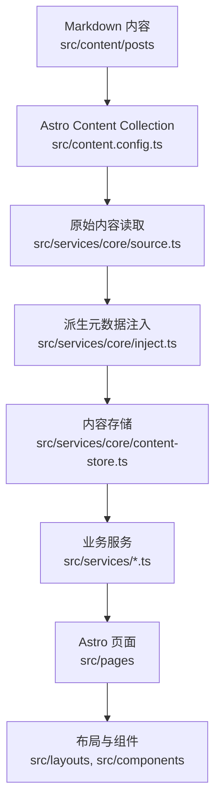

# 项目架构

本项目是基于 Mizuki 深度定制的 Astro + Svelte 静态博客。当前改造目标是让页面、内容、配置和 Agent 协作边界清晰可维护。

## 运行模型

Astro 在构建期读取 Markdown 内容，通过 `src/services/core` 生成统一内容存储，再交给页面、布局和组件渲染。

## 核心目录

| 路径 | 说明 |
| --- | --- |
| `src/pages` | Astro 路由和静态端点。页面应尽量保持轻量。 |
| `src/layouts` | 页面外壳和网格布局。 |
| `src/components` | Astro 与 Svelte UI 组件。 |
| `src/services/core` | 内容读取、排序、派生元数据、分类标签索引、内容缓存。 |
| `src/services` | 首页、归档、分类、组件、文章详情等业务服务。 |
| `src/content` | Astro 内容集合，包含文章和特殊页面。 |
| `src/data` | 时间线、日记、友链、项目、设备、技能等非文章数据。 |
| `src/utils` | URL、日期、内容处理、组件和客户端行为工具。 |
| `public` | 构建时原样复制的静态资源。 |
| `scripts` | 内容同步、文章创建、番剧数据、字体压缩、索引提交等脚本。 |
| `docs` | 项目文档，按开发者和 Agent 分区维护。 |

## 内容管线

1. `src/content.config.ts` 定义 `posts` 和 `spec` 内容集合。
2. `src/services/core/source.ts` 中的 `getAllPostsRaw()` 从 Astro Content Collection 读取文章。
3. 草稿过滤在 `getAllPostsRaw()` 中完成：
   - 开发环境包含草稿。
   - 生产环境排除 `draft: true` 的文章。
4. `injectSystemMeta`、`injectListMeta`、`injectNavigationMeta` 为文章注入系统元数据、摘要、阅读时间和上下篇导航。
5. `buildContentStore()` 生成统一内容存储：
   - `posts`
   - `categoryMap`
   - `categories`
6. 页面和业务服务优先消费 `getContentStore()`。

## 路由说明

| 路由文件 | 说明 |
| --- | --- |
| `src/pages/index.astro` | 首页文章列表和分类导航。 |
| `src/pages/posts/[...slug].astro` | 文章详情页，由 `buildPostDetailStaticPaths` 生成路径。 |
| `src/pages/[permalink].astro` | 自定义 permalink 支持。 |
| `src/pages/category/[slug]/index.astro` | 分类第一页。 |
| `src/pages/category/[slug]/page/[page].astro` | 分类分页。 |
| `src/pages/archive.astro` | 归档页。 |
| `src/pages/rss.xml.ts`、`src/pages/atom.xml.ts` | Feed 输出。 |
| `src/pages/og/[...slug].png.ts` | Open Graph 图片生成。 |

## 配置入口

主要配置位于 `src/config.ts`，类型位于 `src/types/config.ts`。

高影响配置包括：

- `siteConfig`：站点信息、语言、特色页面、横幅、主题、字体、文章列表行为。
- `navbarConfig`：顶部导航。
- `profileConfig`：个人资料组件。
- `sidebarLayoutConfig`：左右侧边栏布局。
- `commentConfig`：评论系统。
- `permalinkConfig`：自定义 URL 策略。

配置结构变化需要同步更新 [配置说明](./configuration.md)。

## 扩展原则

- 新增文章字段：先改 `src/content.config.ts`，再改 `src/services/core` 的派生逻辑。
- 新增非文章数据：优先放到 `src/data`。
- 新增 Widget：放入 `src/components/widget`，并在 `src/services/widget/registry.ts` 注册。
- 新增页面逻辑：先封装到 `src/services`，再接入 `src/pages`。
- 分类、标签和 permalink URL 不要硬编码，使用 `src/utils/url-utils.ts`、`src/utils/client-utils.ts`、`src/utils/permalink-utils.ts`。

