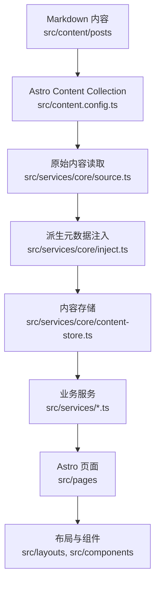

# 项目架构

本项目是基于 Mizuki 深度定制的 Astro + Svelte 静态博客。当前改造目标是让页面、内容、配置和 Agent 协作边界清晰可维护。

## 运行模型

Astro 在构建期读取 Markdown 内容，通过 `src/services/core` 生成统一内容存储，再交给页面、布局和组件渲染。



## 核心目录

| 路径 | 说明 |
| --- | --- |
| `src/pages` | Astro 路由和静态端点。页面应尽量保持轻量。 |
| `src/layouts` | 页面外壳和网格布局。 |
| `src/components` | Astro 与 Svelte UI 组件。普通业务展示组件按领域放置。 |
| `src/components/ui` | 通用可渲染 UI 组件实现层，例如 Icon、Panel、Button 等不绑定具体业务的组件。 |
| `src/components/modules` | 有自有交互逻辑、runtime controller、事件协议、storage 或 Svelte store 的组件模块。 |
| `src/design` | 跨功能视觉规则的唯一所有者：token、Theme、Foundation、Pattern 与 Legacy 兼容；不放 Astro/Svelte 组件。 |
| `src/services/core` | 内容读取、排序、派生元数据、分类标签索引、内容缓存。 |
| `src/services` | 首页、归档、分类、Feed、日历数据、组件、文章详情等业务服务。 |
| `src/content` | Astro 内容集合，包含文章和特殊页面。 |
| `src/data` | 时间线、日记、友链、项目、设备、技能等非文章数据。 |
| `src/utils` | URL、日期、内容处理、组件和客户端行为工具。 |
| `public` | 构建时原样复制的静态资源。 |
| `scripts` | 内容同步、文章创建、番剧数据、字体压缩、索引提交等脚本。 |
| `docs` | 项目文档，按开发者和 Agent 分区维护。 |

## 服务层与 View Model 边界

后续拆分大文件时，应继续沿用当前的逻辑与页面解耦方案：`src/services/` 承载页面逻辑和 view model，`src/pages/` 保持路由入口轻量，拆出来的页面组件尽量只负责展示。

推荐边界如下：

- `src/services/` 负责页面逻辑、数据适配、配置归一化、static paths 构建、页面级 view model 生成。
- `src/pages/` 只负责路由入口：调用 service、组合 layout/component、把 view model 传给展示组件。
- `src/components/` 与 `src/layouts/` 负责渲染和局部展示结构。由页面拆出的组件应尽量是 presentational component。
- `src/components/ui/` 是 Design contract 的组件实现层，可以消费 Semantic token 和 `ds-` Pattern class，但不定义新的跨项目视觉系统。
- `src/components/modules/` 承载组件级应用模块。模块内部可以有 `controller.ts`、`runtime.ts`、`storage.ts`、`events.ts`、`state.ts` 和 `types.ts`，这些文件只服务于本模块。
- 浏览器运行时交互不放入 `src/services/`，例如 DOM 监听、音频播放、pointer/mouse/touch 事件、localStorage UI 状态、Svelte runtime store，应放在所属组件或 module 目录旁边。
- `src/services/core` 仍然是内容管线边界。普通文章集合、分类、标签、归档和文章详情数据不要绕过 `getContentStore()`。

厚页面推荐拆分方式：

```text
src/pages/anime.astro
src/services/anime.ts
src/components/anime/
  AnimePage.astro
  AnimeToolbar.astro
  AnimeGrid.astro
  AnimeCard.astro
  types.ts
```

复杂运行时功能推荐使用 module-local 结构：

```text
src/components/modules/music-player/
  MusicPlayer.svelte
  MiniPlayer.svelte
  ExpandedPlayer.svelte
  PlaylistPanel.svelte
  audio-controller.ts
  storage.ts
  types.ts
```

拆分时优先把 helper 和类型留在所属 module 目录内。只有当多个无关功能都复用同一段逻辑时，才提升到共享的 `src/utils` 或通用 service。

首页与分类页使用独立页面组合，并共享 Post Card、Category Card 与 Grid 契约。首页由 `src/services/home.ts` 输出最近更新、推荐阅读和文章分类三个区块；最近更新与推荐阅读各 3 篇，文章分类复用分类 Hub card 视图模型并最多展示前 6 个分类，但隐藏每类最近文章列表，让首页分类 card 保持入口职责。首页区块右上角入口优先导向分类发现体系：最近更新进入 `/category/recent/` 的最近更新视图，推荐阅读进入 `/category/recommended/` 的推荐视图，文章分类进入 `/category/`。`/category/` 是分类 Hub，不是具体分类；它展示分类卡片、热门 Tag 和每类最近文章。`/category/recent/` 与 `/category/recommended/` 复用分类 Hub 壳层，分别按全站最近活动时间和 `sortByScore()` 展示文章，不参与具体分类的 Tag JSON 索引。具体分类页每页 12 篇，并在主内容顶部拥有分类与 Tag 筛选器。Astro SSG 页面 props 只保留当前页文章与不含 `data` 的分页元数据；每个具体分类另外生成一份 `/api/categories/{slug}.json/` 紧凑索引。普通分类页在首屏 `load` 完成且页面可见、在线、未启用 `Save-Data`、网络不属于 `2g` 或 `slow-2g` 时，才在浏览器 idle 阶段低优先级预取索引；合法 Tag 查询仍会立即加载，因网络条件跳过的预取不会阻止后续请求。索引 Promise 按完整 URL 隔离并以 3 个分类为上限执行 LRU 淘汰，因此同一分类的预取、Tag 切换、分页和 history 共用请求，而旧分类响应不会写入当前组件状态。查询参数、请求状态、失败重试、过滤和客户端分页逻辑与分类组件共置在 `src/components/category/category-page-client.ts`。

所有 `MainGridLayout` 页面使用 `container-content` 布局策略。Banner 始终铺满 viewport，Navbar 与 Main Shell 使用统一的 `1280px` 外部最大宽度。首页显式提供一份 Profile support 内容：`1200px` 以上为最大 `992px` 的三列 Feed + `248px–272px` support column，`880px–1199px` 为最大 `656px` 的双列 Feed + support column，低于 `880px` 时同一个 Profile DOM 移到 Main 前方；Feed 在 `608px` 以下退为单列，并在 `932px` 进入三列。普通 `content` 页面无 support 时在 `1200px` 以下最大 `656px`，达到 `1200px` 后最大 `992px`。全站发现入口由 `src/services/support.ts` 统一生成，并通过 `GlobalDiscoveryCard.astro` 渲染：全部分类 card 展示分类项，最近更新与推荐阅读 card 展示文章项。分类 Hub 会隐藏当前视图对应的发现 card，只展示其他发现入口；具体分类页展示全部全站发现入口，并且这些 card 使用全站文章池，当前分类文章列表与 Tag 筛选只留在主内容区，右栏不再重复当前分类上下文模块。文章详情页提供 `PostSupport` support slot：桌面承载文章目录与同一组全站发现入口，局部相关推荐和随机文章保留在正文后置区域，低于 `880px` 时隐藏侧栏并由正文后的移动端模块补足推荐入口；文章正文内部仍使用阅读宽度。站点统计由 `src/services/footer.ts` 生成 View Model，并由 `src/components/footer` 在 Footer 中渲染一次。归档页在主内容流中拥有 Calendar 与 Timeline，只负责时间维度浏览；分类和 Tag 浏览由分类页持有。`PanelCard.astro` 只负责通用卡片 Surface，不负责注册、解析或放置业务组件。

页面 Shell 不再支持旧 `pageScaling` 根字号缩放，避免在 1280px 附近同时存在 px Shell 预算和 rem 全局缩放。文章桌面 TOC 由 `PostSupport` 在 support 列内 sticky 展示；窄屏继续使用已有 Floating Tools TOC 入口。桌面 TOC、移动端 TOC 和 Floating TOC 都消费 `src/components/post-toc/` 的共享 TOC 数据、graph、active tracker 与 runtime 刷新契约，普通文章使用构建期 `headings`，加密文章只在解密后从解密正文 root 显式生成 runtime TOC。active tracker 在布局稳定后测量 heading breakpoint，滚动时按方向推进当前 index；组件不得在无命中帧默认回退到第一项。桌面 TOC 额外维护 viewport state machine：页面顶部与底部只展示一级目录列表，正文阅读过程中一级目录常驻可见且仅展开当前 root 分支，DOM class 与 indicator 都是 state 的渲染结果，不反向参与 active 判断。TOC 支持的标题层级由 `siteConfig.toc.depth` 控制，graph 与桌面渲染必须保留配置范围内的多级父子关系和缩进。

分类页与文章详情页在 Banner 与 Fullscreen 模式下保留横幅几何，但 Navbar 行为与首页解耦：只有首页使用 `banner-aware` 的透明度/滚动状态，分类页与文章详情页使用始终可见的 `fixed-visible` 状态。这两种模式的普通导航、首次直达分类/文章 URL 与浏览器前进/后退都由 Shell 自管 easing 动画定位到实际的 `.page-main-content` 区域，以其文档坐标减去 CSS `scroll-margin` clearance 得出统一位置，不再维护额外的零高度锚点；Overlay、None 和 Hash 导航不执行该定位。页面身份取自新容器的 interaction policy，不依赖内容替换阶段的瞬时 URL。

`main-grid-client` 是 Banner 可见性与 `content-start` 滚动的唯一 runtime owner。普通分类/文章链接在 `content:replace` 后执行一次 Shell 自管 easing 动画，首次直达分类/文章 URL 复用同一套可取消动画；浏览器 history 在 settled 阶段同步 Banner 几何后启动较短的专用入口动画，并在动画完成或取消后才发布 Navigation Progress `idle`。动画可被滚轮、触摸、指针和滚动按键中断，并在 `prefers-reduced-motion` 下退化为即时定位。旧的 `layout-client` 只为未声明 `content-start` 的页面执行回到顶部，不再重复添加移动端 Banner 隐藏 class。

页面切换不再使用固定 `300vh` 扩展高度。Shell 在 `visit:start` 记录旧页面 `scrollHeight`，在 `content:replace` 后只为更短的新页面补充精确高度差，并在入口动画或 history 校正完成后以短过渡释放 `PageHeightGuard`。Grid Card 的 `contain-intrinsic-size` 与固定 `29rem` 高度一致，避免离屏行进入渲染范围时再次修改文档总高度。

Shell 自有的顶部 Navigation Progress 使用 Semantic `--accent` 与 Motion token 表达 Swup 请求和替换状态。它从 `visit:start` 开始、在 `content:replace` 推进并于 `visit:end` 完成，快速导航也保留最短可见时间。历史访问禁用 Swup 的缓存位置恢复，并在 settled 阶段临时关闭内容层 `top` transition、同步 Banner class、完成语义入口定位后才发布 `idle`。进度条不占布局高度，也不等待图片、统计、搜索或 Svelte hydration 完成。

首页首次直达使用 `home-initial-enter` 作为短生命周期首屏编排 class。它不改变 Banner 或 Main Content 的最终几何，只协调 Banner 标题、字幕、waves 与 Main Content 的 opacity/transform 入场；标题与字幕使用同一套首屏动画。首页 Banner 的 subtitle 只在 `homeText.typewriter.enable` 为 `true` 时渲染，并通过 Typewriter 的 `startDelay` 在首屏编排之后启动；完成后进入 `home-initial-enter-done`，避免标题和字幕在 class 切换时重播默认动画；`prefers-reduced-motion` 下立即结算该状态。普通 Swup 页面切换仍由 `transition-swup-layout` 和 page-entry runtime 所有。

文章详情路由保持轻量：`src/pages/posts/[...slug].astro` 负责 static paths 并把页面模型转交给 `src/components/post-detail/PostDetailPage.astro`。Header、最后修改时间、上下篇导航和页面级样式与展示组件放在同一 feature 目录；TOC 等运行时消费者继续使用稳定的 `#post-container` 与 `.markdown-content` hook，但不得各自重复全页面 heading 扫描、文本清洗、active heading 计算或滚动 offset 逻辑。

`src/components/misc/Markdown.astro` 是普通文章与加密文章共用的唯一内容样式入口，统一加载 Markdown、扩展内容和 Expressive Code 样式；加密组件只负责保护与解密状态。代码复制交互位于 `src/components/modules/post-content/post-content-client.ts`，不再混入展示容器。

路由切换动画由 `#swup-container` 的 `.transition-swup-layout` 单点负责。Navbar 与页面模块可以保留各自有意义的入场效果，文章列表项保留序列动画；文章详情内部区块不再叠加通用入场动画，避免嵌套位移和重复延迟。

## 内容管线

1. `src/content.config.ts` 定义 `posts` 和 `spec` 内容集合。
2. `src/services/core/source.ts` 中的 `getAllPostsRaw()` 从 Astro Content Collection 读取文章。
3. 草稿过滤在 `getAllPostsRaw()` 中完成：
   - 开发环境包含草稿。
   - 生产环境排除 `draft: true` 的文章。
4. `buildPostIndexEntries()` 从 Astro 已准备好的 `entry.rendered.metadata` 读取摘要、字数和阅读时间，并生成不含正文的 `PostIndexEntry`。
5. Post Index 构建同时返回轻量文章索引与 `buildPostRouteIndex()` 创建的权威 RouteIndex；`buildContentStore()` 直接保留该 RouteIndex 的对象身份，并在构建期拒绝数量、缺失项或 route identity 漂移。Content Store 只保存文章索引、ID/Route Map、分类标签 Taxonomy 与聚合统计；不得保存 Markdown 正文、渲染 HTML、密码或详情专用 frontmatter。
6. `getContentStore()` 缓存初始化 Promise，首次并发调用共享同一次构建；初始化失败和 Vite HMR disposal 会清除缓存。
7. 文章 static paths 只携带 canonical slug 与文章 ID。详情 service 按 ID 获取 RawPost，通过有上限的共享队列生成 `Content`、headings 与详情 View Model；UI 不接触 RawPost。
8. Astro 文章卡片消费可序列化的 `PostCardViewModel`；分类 Tag JSON 使用不含重复 `meta` 的 `ClientPostCard`，Svelte 在首屏稳定后按网络条件 idle 预取，或在合法 Tag 模式立即加载这份索引。
9. RSS 与 Atom 只从 `PostIndexEntry` 构建 `FeedItemViewModel`，正文采用 `description || excerpt || title` 摘要语义。Feed 不读取 RawPost、不渲染 Markdown；Atom 通过 XML serializer 统一转义文本和属性。

数据层级如下：

```text
RawPost
├─ PostIndexEntry：构建态轻量索引
├─ PostCardViewModel：浏览器可序列化卡片字段
├─ ClientPostCard：分类 Tag 模式按需加载的紧凑卡片字段
├─ FeedItemViewModel：RSS/Atom 共用的摘要、URL、时间与 Taxonomy
└─ PostDetailPageProps：Content、headings 与详情资源
```

## 路由说明

| 路由文件 | 说明 |
| --- | --- |
| `src/pages/index.astro` | 首页文章列表和分类导航。 |
| `src/pages/posts/[...slug].astro` | 文章详情页，由 `buildPostDetailStaticPaths` 生成路径。 |
| `src/pages/category/index.astro` | 分类 Hub 的全部分类视图，底层由 `src/services/category-hub.ts` 生成页面数据。 |
| `src/pages/category/recent/index.astro` | 分类 Hub 的最近更新视图，使用全站最近活动时间排序。 |
| `src/pages/category/recommended/index.astro` | 分类 Hub 的推荐视图，使用全站推荐分排序。 |
| `src/pages/category/[slug]/index.astro` | 具体分类第一页，底层由 `src/services/category-page.ts` 生成页面数据。 |
| `src/pages/category/[slug]/page/[page].astro` | 分类分页，底层由 `src/services/category-page.ts` 生成页面数据。 |
| `src/pages/api/categories/[slug].json.ts` | 每分类一份紧凑 Tag 索引；普通分类访问不会下载。 |
| `src/pages/archive.astro` | 归档页。 |
| `src/pages/rss.xml.ts`、`src/pages/atom.xml.ts` | 摘要型 Feed 输出，底层由 `src/services/feed.ts` 统一数据和 XML 语义。 |
| `src/pages/og/[...slug].png.ts` | Open Graph 图片生成。 |

## 配置入口

主要配置位于 `src/config.ts`，类型位于 `src/types/config.ts`。

高影响配置包括：

- `siteConfig`：站点信息、语言、特色页面、横幅、主题、字体、文章列表行为。
- `navbarConfig`：顶部导航。
- `profileConfig`：首页作者资料模块内容。
- `pageLayoutPolicies`：页面 Shell Strategy 与由配置确定的 Desktop Layout。
- `commentConfig`：评论系统。

配置结构变化需要同步更新 [配置说明](./configuration.md)。

## 扩展原则

- 新增文章字段：先改 `src/content.config.ts`，再改 `src/services/core` 的派生逻辑。
- 分类定义由 `src/config/category-slugs.ts` 维护规范名称、slug 与兼容 alias，`src/services/core/taxonomy.ts` 在内容进入 Post Index 前完成统一；同义分类不得在 Content Store 中形成不同 route。
- 分类展示资产由 `src/data/category-assets.ts` 维护，完整新增、重命名、合并、删除和数据库迁移流程见 [分类管理](./category-management.md)。
- 新增非文章数据：优先放到 `src/data`。
- 新增页面模块：放入所属领域目录，通过路由或 layout 显式组合；只有被多个无关功能复用的视觉外壳才提升为 `src/components/ui` 组件。不要恢复通用 placement registry。
- 网站级通知由 `src/content/notifications/*.md` 编写正文与元数据，`src/services/site-notice.ts` 负责路由可见性、默认值和 Activity Center View Model。Activity Center 是 Navbar 级基础设施，始终渲染；没有通知内容时展示空通知状态。通知正文由 Astro 构建期 Markdown 管线渲染，再交给 Svelte 弹窗展示；浏览器端不解析 Markdown。
- 右上角 Activity Center 由 `src/components/modules/activity-center` 统一拥有，是信息入口而不是快捷操作入口。Navbar 中的 Bell Badge 只表达未读通知数，外圈只表达文章阅读进度；Panel 组合通知摘要列表与当前文章的阅读百分比、当前 Heading、预计剩余时间和本地续读位置。点击通知打开完整 Markdown 弹窗并写入已读；需要确认的通知只有点击“我知道了”才写入确认。`normal`、`important`、`urgent`、`critical` 等级控制排序和打扰强度，其中 `important`/`urgent` 未读时每个浏览器会话自动展开一次面板，`critical` 未确认时每个浏览器会话自动打开一次弹窗；`pinned` 独立表达置顶和自动打开策略。`info`、`success`、`warning`、`danger` 仍只表达视觉状态。阅读状态只读取 `#post-container` 暴露的标题与分钟元数据，并把浏览器交互状态保留在 Feature 内，不进入 `src/services`。
- Activity Center 与 Floating Tools 新增的 Shell Icon 必须保存到 `src/assets/icons/material-symbols`，并在 `src/components/ui/local-icons.ts` 显式登记，由 Astro/Svelte 两个 `LocalIcon` Renderer 以本地 Mask Asset 呈现，不得在运行时请求 Iconify API。Activity Center 遇到未登记的动态通知图标时回退为本地 Info Icon；新增通知图标时应同步补充 SVG 与 Registry。
- 右下角 Floating Tools 由 `src/components/modules/floating-tools` 统一拥有 viewport placement、响应式触摸尺寸与展开状态，并在 `MainGridContent.astro` 中挂载到整个动画 Main Content Layer 外。Theme、Music、Settings、Floating TOC 与 Back to Top 继续拥有各自行为，只把入口组合进统一 Rail；新的 Shell 悬浮入口不得再单独声明互相竞争的右下角 fixed 坐标。Settings 必须使用传入的 Feature class 形成真正的 viewport Panel，不能把 Astro 的 `class:list` 语法用于 Svelte 组件。
- Live2D Companion 与 Music Player 的 `enable` 配置只提供首次默认挂载状态，不能作为功能可用性的硬门槛；Floating Tools 始终保留对应入口，并分别通过 `live2d-companion-mounted` 与 `music-player-mounted` 记录访客选择。Live2D Companion 的 iframe 隔离、事件入口、expression 面板、拖拽位置和模型维护规则集中记录在 [Live2D Companion 维护指南](./live2d-companion-maintenance.md)。Music Player 通过 `src/components/modules/music-player/events.ts` 接收模块 UI 显隐命令并发布播放、加载、可见与展开状态；Floating Tools 只消费该契约并根据播放器占用高度避让，不直接持有 Audio 或面板状态，也不通过 DOM Mutation 反推播放器状态。
- 新增页面逻辑：先封装到 `src/services`，再接入 `src/pages`。
- 分类、标签和文章 URL 不要硬编码。共享 URL 拼接使用 `src/utils/url.ts`，分类与标签规范化使用 `src/services/core/taxonomy.ts`，文章 canonical URL 使用 `src/services/core/post-routes.ts`。图片 glob、Astro Content 类型与 Node API 只属于 `src/services/core/content-assets.ts`，不得进入客户端依赖图。

首页的“文章分类”区块通过 Content Store 的分类导航数据构建，复用 `src/services/category-hub.ts` 的分类 card 视图模型；首页只截取前 6 个分类，并通过 `CategoryCardGrid` 的展示开关隐藏最近文章列表，不在组件中重新计算分类、标签或文章 URL。

## 首页与文章视觉基础

首页和文章详情页通过 `src/design/` 统一 Surface、文本层级、内容宽度、页面间距与 Typography。其他功能页仍可通过 Legacy token 保持兼容，详细分层和迁移规则见 [Design System](./design-system.md)。

- 首页文章列表使用 `--width-listing`，不随主内容列无限扩张。
- 通用正文阅读流使用 `--width-reading: 48rem`；文章详情页的 Header、正文、封面与后置区块共享 `--width-reading-wide`，代码、表格、图片与数学公式继续服从该宽内容 rail。
- 普通模式下文章详情页使用 `ds-surface-card` 作为阅读卡片边界；壁纸透明或 Overlay 模式仍使用半透明背景、轻边框与 blur，以维持可读性。
- 首页和文章详情页优先消费 `--surface-*`、`--text-*`、`--border-*` 与 `--accent` 等 Semantic token。旧的 `--card-bg`、`--primary`、`--line-*` 等变量由 Compatibility 层供值，不应在新代码中继续扩散。
- 页面级留白使用 `--space-page-x`、`--space-content` 与 `--space-cluster`；组件内部的小型布局仍可使用 Tailwind spacing utility。

Design 层不拥有具体 Feature 动画、浏览器交互或第三方库主题；这些规则继续由所属 Feature 管理。
