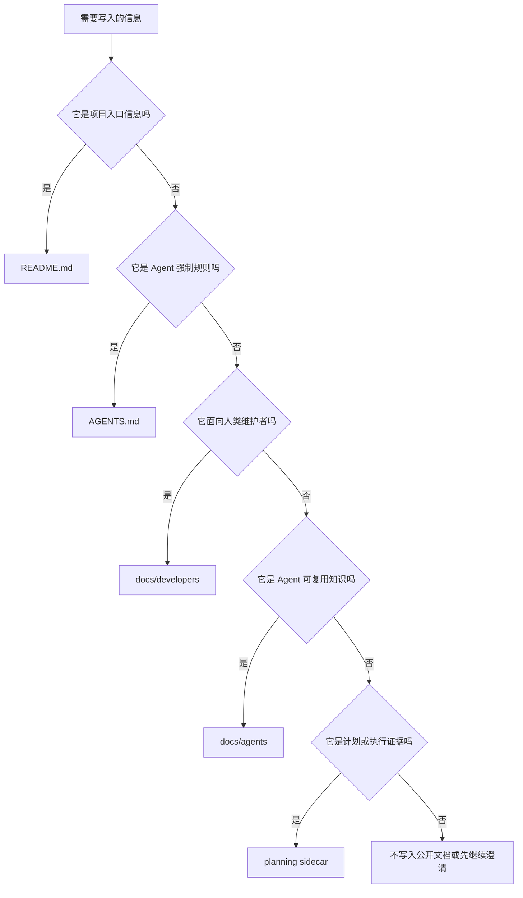
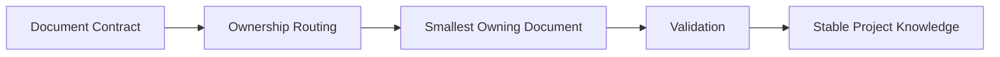

[agent-docs](https://github.com/whynotsnow/agent-skills/tree/main/skills/agent-docs) 是为真实开发项目准备的 documentation governance skill。它不负责生成漂亮的项目宣传文案，而是负责判断一个项目的文档应该如何分层、每份文档应该由谁拥有、哪些信息不应该被塞进 README。

在当前 blog 项目里，`agent-docs` 的价值尤其明显。这个项目从 Mizuki 8.2 基线继续演进后，已经有独立的 `content pipeline`、`service layer`、`Design System`、`runtime modules`、`impact-based testing` 和 Coding Agent 协作流程。如果没有明确的 documentation ownership，README 很容易重新变成一份又长又过时的“魔改清单”。

## 🧭 它是什么

`agent-docs` 是一个维护项目文档契约的 skill。它定义真实 source repository 至少应该有这些入口：

```text
README.md
AGENTS.md
docs/
├── README.md
├── developers/
│   └── README.md
└── agents/
    └── README.md
```

这些文件不是为了“看起来规范”，而是为不同读者提供稳定入口：

| 入口 | 主要读者 | 负责内容 |
| --- | --- | --- |
| `README.md` | 第一次进入项目的人 | 项目身份、快速开始、主要能力、文档入口。 |
| `AGENTS.md` | Coding Agent | 修改代码前必须遵守的强制规则。 |
| `docs/README.md` | 所有人 | 文档 routing index。 |
| `docs/developers/` | 人类开发者和维护者 | 中文开发、配置、内容、部署、测试文档。 |
| `docs/agents/` | Coding Agent | 英文 workflow、project map、runtime playbook、testing strategy、memory。 |

它的核心判断是：文档先有 owner，再写内容。

## 🧩 它有什么用，解决了什么问题

没有文档治理时，一个持续重构项目通常会出现五类问题。

第一，README 失控。所有新功能、历史变更、配置说明、部署细节、Agent 规则都会被追加进去，最后入口文档变成历史仓库。

第二，读者混乱。人类维护者想找部署变量，却被 Agent 执行规则打断；Agent 想找工具边界，却读到长篇产品介绍。

第三，规则重复。`AGENTS.md`、README、开发文档和 Agent 文档里各写一遍同一条规则，几次变更后就互相矛盾。

第四，过程记录污染正式文档。一次任务的 validation evidence、handoff 或临时决策被写进主仓库文档，但它们其实应该属于 sidecar。

第五，公开文档混入本地状态。机器路径、profile ID、原始日志或私有 URL 一旦写进公开 docs，就很难清理干净。

`agent-docs` 用 ownership boundary 解决这些问题：



这张图比“所有内容都写 README”严格得多，也更适合长期维护。

## 📦 如何安装

推荐使用一个具备本地文件操作和 GitHub 仓库读取能力的 Coding Agent 来完成安装，而不是手动复制 skill 目录。这个 Agent 可以是 Codex、Claude Code、Cursor、Cline 或其他类似工具。关键不是它必须支持某个固定的 skill 机制，而是它能读取仓库、保留目录结构、检查已有版本，并把安装结果说明清楚。

可以把下面这段提示词交给安装 Agent：

```text
请从 GitHub 仓库 https://github.com/whynotsnow/agent-skills 安装 agent-docs 这个 Coding Agent skill。

要求：
1. 只安装或更新仓库中的 skills/agent-docs 目录。
2. 优先安装到当前 Coding Agent 支持的 skill、rules 或 reusable instruction 目录；如果当前工具没有专门的 skill 机制，请保留原目录结构安装到该工具推荐的可复用上下文位置。
3. 安装前检查本机已有 agent-docs 是否存在，存在时先说明将如何覆盖、合并或更新。
4. 安装后确认 SKILL.md、references/ 和 scripts/ 可用。
5. 不要修改当前业务项目文件，也不要把本机路径、账号信息或安装日志写入公开仓库。
6. 完成后告诉我安装结果、安装位置的脱敏描述，以及后续如何让 Coding Agent 调用 agent-docs。
```

安装完成后，新的 Coding Agent 会在任务匹配时读取 `agent-docs` 的 `SKILL.md`，再按其中的文档契约和 reference routing 工作。

## 🛠️ 如何使用

### 在自己的项目中接入

安装 skill 后，不建议直接让 Coding Agent 套模板。更稳妥的方式是先让它审查你的项目现有文档、读者、维护方式和隐私边界，再由你确认是否接入以及接入到什么程度。

可以把下面这段提示词交给已经安装 `agent-docs` 的 Coding Agent：

```text
我已经安装了 agent-docs。请在当前项目中评估是否适合接入 Agent Docs 文档契约。

请先只做审查和方案，不要直接修改文件：
1. 阅读项目现有 README、AGENTS 或同类 Agent 指令、docs 目录和 package scripts。
2. 判断 README、开发者文档、Agent 文档和项目规则目前分别由哪些文件承担。
3. 检查是否存在重复、过时、读者混杂或本地隐私信息泄露风险。
4. 给出推荐的文档结构、需要新增或调整的文件、语言选择和验证命令。
5. 明确哪些内容不应该写入公开仓库。
6. 等我确认方案后，再按最小改动接入 agent-docs，并运行可用的文档验证。
```

如果你的项目还很小，接入结果可能只是整理 README 和 Agent 指令；如果项目已经有复杂架构、部署流程或长期 Agent 协作，再考虑拆出 `docs/developers/` 和 `docs/agents/`。

### 常用命令

在一个已有项目中使用 `agent-docs`，通常从检查文档结构开始：

```bash
python3 /path/to/agent-docs/scripts/agent_docs.py status
```

如果只是确认当前项目是否满足文档契约，可以运行：

```bash
python3 /path/to/agent-docs/scripts/agent_docs.py validate
```

如果需要审计文档是否存在漂移，可以运行：

```bash
python3 /path/to/agent-docs/scripts/agent_docs.py audit
```

对 Coding Agent 来说，更重要的是使用方式，而不是命令本身：

1. 先判断当前任务是否真的需要改文档。
2. 如果要改文档，先确认 owning document。
3. 能链接到现有 owner 时，不复制一份长内容。
4. 涉及本地状态、runtime observation 或 raw logs 时，先检查 disclosure boundary。
5. 文档结构或公开规则变更后，运行 `agent_docs.py validate`。

在当前 blog 项目中，还要继续运行项目自己的 Agent Workspace validator：

```bash
node .agent-workspace/tools/agent-workspace.mjs validate
```

因为 `agent-docs` 负责文档契约，而当前项目还额外声明了 Agent Workspace Spec。

## ⚙️ 它是如何工作的

`agent-docs` 的工作方式可以理解为三层。

第一层是 contract。它规定真实开发项目应该具备哪些文档入口，以及每个入口应该拥有什么内容。

第二层是 routing。它根据变更内容判断应该更新哪个文档，而不是让 README 承接所有东西。

第三层是 validation。它检查必需文件、文档结构和 disclosure boundary，避免公开文档混入不该公开的内容。



它不是一个“写文档模板”的工具。模板只能解决开头，不能解决长期维护。`agent-docs` 真正关心的是每次项目变化后，文档还能不能保持清晰边界。

## 📌 在 blog 项目中如何被使用

当前 blog 项目的 README 已经按 `agent-docs` 思路重新定位：它不再逐条记录所有 Mizuki 改动，而是说明项目身份、Mizuki 8.2 基线、接近 `Mizuki 9.0.0` 级别的工程化迭代、Coding Agent 支持、快速开始和文档入口。

详细内容则按读者拆分：

```text
docs/
├── README.md
├── developers/
│   ├── architecture.md
│   ├── configuration.md
│   ├── content-guide.md
│   ├── deployment.md
│   └── testing.md
└── agents/
    ├── workflow.md
    ├── project-map.md
    ├── testing-strategy.md
    ├── runtime-playbook.md
    ├── failure-index.md
    └── memory.json
```

这套结构让不同类型的改动有稳定落点：

| 改动类型 | 应更新的位置 |
| --- | --- |
| 项目定位、安装方式、主要能力 | `README.md` |
| Coding Agent 必须遵守的规则 | `AGENTS.md` |
| 架构、配置、部署、内容写作 | `docs/developers/` |
| Agent workflow、project map、failure memory | `docs/agents/` |
| 计划项、决策、run、handoff | `../blog.plan` |

也就是说，`agent-docs` 在这个项目中承担的是文档治理角色。它让 Coding Agent 在修改文档时先问“这条信息属于哪里”，而不是默认把内容追加到 README。

## 🔗 和另外两个 skill 的配合

`agent-docs` 解决文档 owner 问题，但它不负责全部 Agent 工作。

当问题变成“这个项目如何声明自己的 manifest、local tooling、public knowledge 和 local state”时，需要 [agent-workspace](/posts/agent-workspace-skill/)。

当问题变成“计划、决策、执行记录、validation notes 和 handoff 应该存在哪里”时，需要 [agent-project-sidecar](/posts/agent-project-sidecar-skill/)。

三者配合后，blog 项目的信息流会更清楚：长期规则进入 docs，本地契约进入 Agent Workspace，计划和执行证据进入 sidecar。
