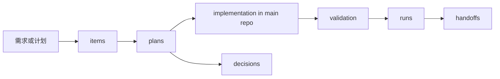
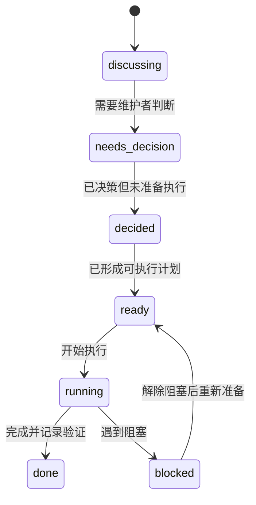
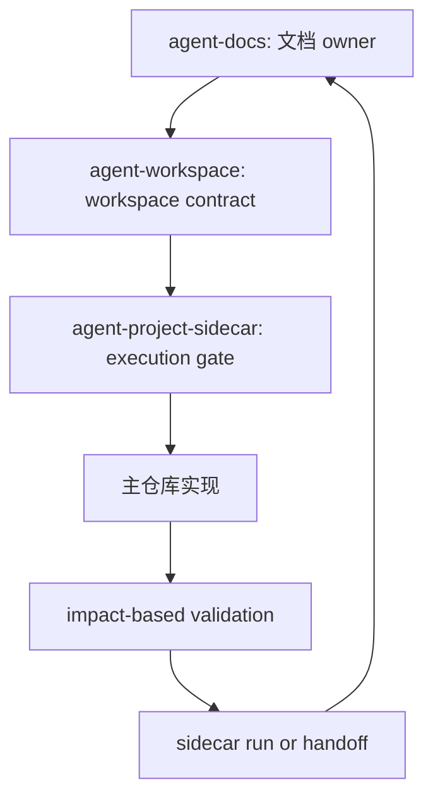

[agent-project-sidecar](https://github.com/whynotsnow/agent-skills/tree/main/skills/agent-project-sidecar) 处理的是计划和执行记录的归属问题。一个持续重构的项目一定会产生 plans、decisions、runs、validation notes 和 handoffs；这些信息需要可追踪，但不应该全部进入产品源码仓库。

当前 blog 项目使用相邻的 `../blog.plan` 作为 planning sidecar。它和主仓库并列存在，主仓库负责产品，sidecar 负责过程。

## 🧭 它是什么

`agent-project-sidecar` 是维护 adjacent planning sidecar 的 skill。它默认把 sidecar 放在主仓库旁边：

```text
blog/
├── README.md
├── AGENTS.md
├── src/
├── docs/
└── package.json

blog.plan/
├── plan.config.json
├── index.json
├── items/
├── plans/
├── decisions/
├── runs/
└── handoffs/
```

这个结构表达了一个清晰边界：产品源码、正式文档、配置和测试属于 `blog/`；计划、决策、执行证据和交接记录属于 `blog.plan/`。

## 🧩 它有什么用，解决了什么问题

没有 sidecar 时，Coding Agent 协作会遇到三个长期问题。

第一，计划状态不清楚。一个想法可能只是 discussing，却被 Agent 当成 ready 直接实现。

第二，执行证据分散。命令跑过没有、为什么这样选、哪些风险没覆盖，这些信息散落在聊天记录里，后续很难恢复。

第三，产品仓库被过程信息污染。README、docs 或 commit message 被迫承载大量计划细节，长期看会变成维护噪音。

Sidecar 的作用是把这些过程信息放到合适的位置：



这样，主仓库只需要呈现最终产品状态；sidecar 则保存“为什么做、如何做、验证了什么、交接给谁”。

## 📦 如何安装

推荐使用一个具备本地文件操作和 GitHub 仓库读取能力的 Coding Agent 从公开仓库安装 `agent-project-sidecar`。这个 Agent 可以是 Codex、Claude Code、Cursor、Cline 或其他类似工具。这个 skill 会处理相邻 planning sidecar 的结构、状态、模板和 disclosure boundary，手动复制容易遗漏 `references/`、`scripts/` 或预览资产。

可以把下面这段提示词交给安装 Agent：

```text
请从 GitHub 仓库 https://github.com/whynotsnow/agent-skills 安装 agent-project-sidecar 这个 Coding Agent skill。

要求：
1. 只安装或更新仓库中的 skills/agent-project-sidecar 目录。
2. 优先安装到当前 Coding Agent 支持的 skill、rules 或 reusable instruction 目录；如果当前工具没有专门的 skill 机制，请保留原目录结构安装到该工具推荐的可复用上下文位置。
3. 安装前检查本机已有 agent-project-sidecar 是否存在，存在时先说明将如何覆盖、合并或更新。
4. 安装后确认 SKILL.md、references/、scripts/ 和 assets/preview/ 可用。
5. 不要创建或修改任何业务项目的 sidecar，除非我后续明确要求。
6. 不要把本机路径、账号信息、sidecar 私有记录或安装日志写入公开仓库。
7. 完成后告诉我安装结果、安装位置的脱敏描述，以及后续如何用它检查、初始化或维护 adjacent planning sidecar。
```

安装完成后，再由具体项目决定是否创建或连接 sidecar。安装 skill 本身不等于为某个项目启用 planning sidecar。

## 🛠️ 如何使用

### 在自己的项目中接入

安装 skill 后，先让 Coding Agent 和你确认项目是否需要 adjacent planning sidecar。Sidecar 适合长期维护、多人或多 Agent 协作、计划和执行证据需要被恢复的项目；如果只是一次性小工具，可能不需要引入完整 sidecar。

可以把下面这段提示词交给已经安装 `agent-project-sidecar` 的 Coding Agent：

```text
我已经安装了 agent-project-sidecar。请评估当前项目是否适合接入 adjacent planning sidecar。

请先只做审查和方案，不要直接创建 sidecar 或修改业务项目：
1. 阅读当前项目 README、AGENTS 或同类 Agent 指令、docs、package scripts 和 Git 提交流程。
2. 判断项目是否需要把 plans、decisions、runs、validation notes、handoffs 与产品源码分离。
3. 推荐 sidecar 路径、基础目录结构、item 状态流、执行门禁和 commit trailer 规则。
4. 明确哪些信息可以进入 sidecar，哪些 credentials、tokens、private URLs、hostnames、local profile IDs 或 raw logs 必须留在本地或 quarantine。
5. 给出初始化步骤、验证命令、主仓库发现 sidecar 的方式和回滚方式。
6. 等我确认方案后，再初始化或连接 sidecar。
```

真正开始使用 sidecar 前，应该先确认状态流、执行授权和主仓库 commit 关联规则，否则它很容易从“计划系统”退化成一组没人维护的 Markdown 文件。

### blog 项目的使用方式

在当前 blog 项目中，最重要的第一步是检查 sidecar 状态：

```bash
pnpm --silent plan:status --json
```

默认只有 `ready` 或 `running` 状态的 item 可以直接执行。`discussing`、`needs-decision`、`decided` 和 `blocked` 不能被自动当成实现授权。

一次 sidecar-backed work 通常这样走：

1. 在主仓库运行 `pnpm --silent plan:status --json`。
2. 找到可执行 item。
3. 读取 sidecar 中的 item、linked plan 和 relevant decisions。
4. 回到主仓库实现代码、内容或文档变更。
5. 运行 `pnpm test:plan` 并按影响面执行验证。
6. 把 sanitized validation evidence 写入 sidecar run。
7. 如果产生长期项目知识，再更新 README、`docs/developers/` 或 `docs/agents/`。
8. 主仓库 commit 带上 `Plan-Item: <id>` trailer。

如果一个变更只是相关而不是执行该 item，可以使用 `Related-Plan: <id>`，不要滥用 `Plan-Item`。

## ⚙️ 它是如何工作的

Sidecar 的核心是状态机和可追踪文件关系。



文件关系大致是：

| 文件类型 | 作用 |
| --- | --- |
| `items/` | 需求或工作项，包含状态、范围和关联计划。 |
| `plans/` | 可执行方案，说明步骤、边界和验证。 |
| `decisions/` | 维护者或项目层面的决策记录。 |
| `runs/` | 执行记录和脱敏验证摘要。 |
| `handoffs/` | 交接说明、剩余风险和后续入口。 |

Sidecar 不只是“多放几个 Markdown 文件”。它让计划项、执行过程和主仓库 commit 之间可以互相追踪。

## 📌 在 blog 项目中如何被使用

当前 blog 项目已经把 `../blog.plan` 作为正式 planning sidecar。典型用途包括：

- 在做结构性重构前先形成 plan。
- 用 `pnpm --silent plan:status --json` 判断是否有可执行 item。
- 把 routine run records 和 validation notes 放在 sidecar。
- 主仓库 commit 通过 `Plan-Item` 或 `Related-Plan` 关联计划。
- 避免把过程性记录塞进 README 或 `docs/agents/execution-log.md`。

在这个项目里，sidecar 还和工程规范严格化绑定。不是所有想法都能立刻实现，也不是所有执行证据都能随便写入公开文档。它要求 Agent 在动手前确认状态，在完成后留下脱敏证据。

## 🔒 安全和 disclosure 边界

Sidecar 可以保存执行摘要，但不能保存敏感信息。

可以保存：

- 运行了哪些命令。
- 哪些检查通过或失败。
- 失败原因的脱敏摘要。
- 影响面选择理由。
- 未覆盖的 residual risks。

不能保存：

- credentials、tokens、cookies、private keys。
- Cloudflare Access JWT。
- private URLs、hostnames、local profile IDs。
- 本机个人身份和机器特定路径。
- 未审查的大段 raw logs。

这些边界和 [agent-workspace](/posts/agent-workspace-skill/) 的 disclosure boundary 一致。

## 🔗 和另外两个 skill 的配合

[agent-docs](/posts/agent-docs-skill/) 负责长期文档 owner，sidecar 负责计划和过程证据。可复用项目知识进入 docs，本次执行记录进入 sidecar。

[agent-workspace](/posts/agent-workspace-skill/) 负责 workspace contract、local tooling 和 local state；sidecar 负责 planning contract、execution traceability 和 handoff。

三者配合时，一次任务会形成这样的闭环：



这条闭环让 Coding Agent 的工作不再只是“这一轮对话里改了什么”，而是可以被审查、恢复和继续维护的工程过程。
