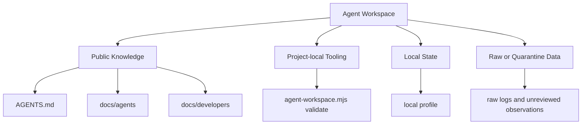
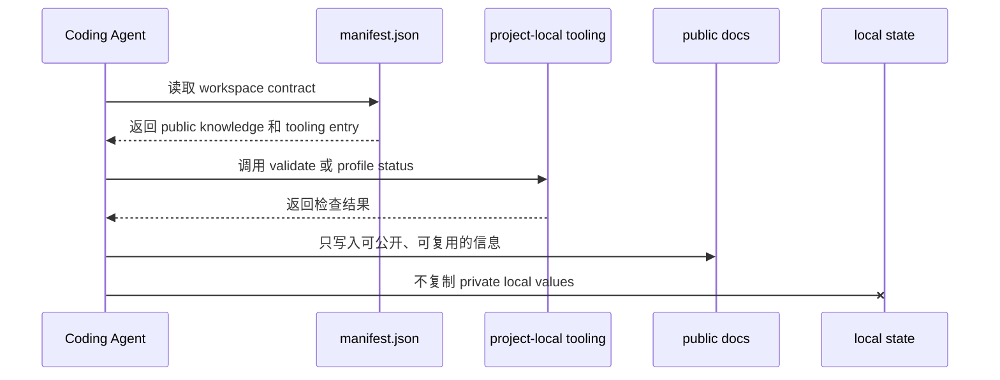

[agent-workspace](https://github.com/whynotsnow/agent-skills/tree/main/skills/agent-workspace) 处理的是 Coding Agent 在真实项目里最容易踩错的边界：这个项目如何声明自己的工作区能力，哪些知识可以公开复用，哪些本地状态只能留在本机，哪些工具是项目本地实现。

它不是为了让项目多一层复杂目录，而是为了让 Agent 在行动前知道“当前 workspace 的契约是什么”。

## 🧭 它是什么

`agent-workspace` 是 Agent Workspace Spec 的 operator skill。它帮助 Agent 识别和维护这些对象：

- `.agent-workspace/manifest.json`
- project-local tooling
- public knowledge
- local state
- runtime profiles
- disclosure boundary

在当前 blog 项目中，关键入口是：

```text
.agent-workspace/
├── manifest.json
├── tools/
│   └── agent-workspace.mjs
├── local/
├── raw/
└── quarantine/
```

其中 `manifest.json` 是公开契约，`tools/` 是项目本地工具，`local/`、`raw/` 和 `quarantine/` 是被 Git 忽略的本地或待审查状态。

一个重要原则是：skill 是 operator，不是 workspace implementation。只要项目 manifest 声明了本地工具，Agent 就应该优先调用项目本地实现。

## 🧩 它有什么用，解决了什么问题

真实项目中的 Agent 工作不只发生在源码文件里。它还会涉及运行命令、读取本地 profile、判断浏览器验证能力、分析失败日志、写 handoff、更新公开记忆。

如果没有 workspace contract，Agent 很容易犯这些错误：

- 不知道本项目声明的 validator 是哪个。
- 用全局 skill 脚本替代项目自己的 local tooling。
- 把 `.agent-workspace/local/` 里的本地 profile 信息写进公开文档。
- 把 raw logs 当成可复用知识直接提交。
- 不区分 public knowledge 和 private runtime observation。
- 在没有检查 runtime requirements 的情况下报告验证完成。

`agent-workspace` 用信息分级解决这些问题：



这套分级让 Agent 可以读取必要上下文，但不会把私有或未审查信息带进公开输出。

## 📦 如何安装

推荐使用一个具备本地文件操作和 GitHub 仓库读取能力的 Coding Agent 从公开仓库安装 `agent-workspace`，而不是手动复制文件。这个 Agent 可以是 Codex、Claude Code、Cursor、Cline 或其他类似工具。这个 skill 涉及 Agent Workspace Spec、manifest、local tooling 和 disclosure boundary，安装时最好由 Agent 帮你检查目录完整性、目标位置和版本覆盖方式。

可以把下面这段提示词交给安装 Agent：

```text
请从 GitHub 仓库 https://github.com/whynotsnow/agent-skills 安装 agent-workspace 这个 Coding Agent skill。

要求：
1. 只安装或更新仓库中的 skills/agent-workspace 目录。
2. 优先安装到当前 Coding Agent 支持的 skill、rules 或 reusable instruction 目录；如果当前工具没有专门的 skill 机制，请保留原目录结构安装到该工具推荐的可复用上下文位置。
3. 安装前检查本机已有 agent-workspace 是否存在，存在时先说明将如何覆盖、合并或更新。
4. 安装后确认 SKILL.md、references/ 和 scripts/ 可用。
5. 不要修改当前业务项目文件，也不要把 .agent-workspace/local/、本机路径、账号信息或安装日志写入公开仓库。
6. 完成后告诉我安装结果、安装位置的脱敏描述，以及如何在项目中识别 manifest 和调用 project-local tooling。
```

安装完成后，`agent-workspace` 只作为 operator 使用。真正的项目验证仍应优先调用目标项目 manifest 声明的 local tooling。

## 🛠️ 如何使用

### 在自己的项目中接入

安装 skill 后，先让 Coding Agent 判断项目是否需要 Agent Workspace Spec，而不是直接创建 `.agent-workspace/`。有些项目只需要清晰的 `AGENTS.md`；有些项目才需要 manifest、local tooling、public knowledge 和 local state 的完整契约。

可以把下面这段提示词交给已经安装 `agent-workspace` 的 Coding Agent：

```text
我已经安装了 agent-workspace。请评估当前项目是否适合接入 Agent Workspace Spec。

请先只做审查和接入方案，不要直接修改文件：
1. 阅读项目现有 Agent 指令、docs、脚本、测试命令和本地工具约定。
2. 判断项目有哪些 public knowledge、local state、raw/quarantine data 和 project-local tooling。
3. 评估是否需要 .agent-workspace/manifest.json，以及 manifest 应声明哪些公开文档和本地工具入口。
4. 明确哪些本地 profile、路径、日志、凭证或环境观察不能写入公开仓库。
5. 给出最小接入步骤、验证命令和回滚方式。
6. 等我确认方案后，再创建或更新 Agent Workspace 文件，并运行项目可用的 validator。
```

如果项目已经有自己的本地工具，manifest 应该声明这些 project-local tooling，而不是让 Coding Agent 用 skill 自带脚本替代项目实现。

### blog 项目的使用方式

在当前 blog 项目中，最常用的方式是直接调用 project-local validator：

```bash
node .agent-workspace/tools/agent-workspace.mjs validate
```

这个命令会检查公开 Agent Workspace 文件、disclosure boundary、runtime 约定和 local profile 关系。

如果 Agent 只是需要理解工作区，应先读 `AGENTS.md`，再按任务需要读取 `.agent-workspace/manifest.json`。只有当 developer、machine、session 或 runtime capability 与任务相关时，才读取本地状态；不要为了显得全面而扫描 `.agent-workspace/local/`。

一个合理的使用顺序是：

1. 读 `AGENTS.md`。
2. 需要工作区契约时读 `.agent-workspace/manifest.json`。
3. 需要本地能力时按 manifest 和 runtime requirements 检查 local profile。
4. 修改公开 Agent Workspace 文件或 memory 后运行 validator。
5. 在最终 handoff 中只报告脱敏结论。

如果项目本地工具缺失，正确做法是报告 workspace capability gap，而不是静默用 skill 自带脚本替代。

## ⚙️ 它是如何工作的

Agent Workspace Spec 把 workspace 拆成四类信息：

| 类别 | 说明 | 是否可公开 |
| --- | --- | --- |
| Public knowledge | 公开规则、文档、spec、schema、可复用 memory | 可以提交 |
| Local state | 本机、本会话、本地 profile 和能力检测 | 默认不提交 |
| Raw data | 原始日志、未审查观察、诊断输入 | 默认不提交 |
| Project-local tooling | 项目声明的本地命令和 validator | 入口可公开，运行结果按披露规则处理 |

工作流程可以表示为：



这也是为什么 `agent-workspace` 不鼓励硬编码工具路径。manifest 声明了项目的正式入口，Agent 应该按入口操作，而不是猜测当前仓库的内部实现。

## 📌 在 blog 项目中如何被使用

当前 blog 项目已经具备 Agent Workspace Spec。它主要用于五个场景。

第一，声明 Coding Agent 的公开知识入口。`AGENTS.md`、`docs/agents/` 和 `docs/developers/` 都属于 Agent 可以读取并复用的公开上下文。

第二，声明 project-local tooling。当前 validator 是：

```bash
node .agent-workspace/tools/agent-workspace.mjs validate
```

第三，保护本地状态。`.agent-workspace/local/` 可以帮助 Agent 理解当前机器或会话能力，但这些细节不能进入 README、文章、docs 或 sidecar。

第四，约束 browser validation。项目文档区分 Playwright、Browser、Chrome 和 Computer Use 的角色，避免 Agent 用错误工具替代验证。

第五，配合 impact-based testing。内容或代码改动先用 `pnpm test:plan` 选择验证范围，再按需要运行项目 validator。

在 blog 项目中，Agent Workspace 的意义不是“多一个目录”，而是把 Agent 的读取、验证、披露和本地能力边界显式化。

## 🔗 和另外两个 skill 的配合

[agent-docs](/posts/agent-docs-skill/) 负责文档应该放在哪里，`agent-workspace` 负责工作区如何声明和验证。

[agent-project-sidecar](/posts/agent-project-sidecar-skill/) 负责计划和执行记录，`agent-workspace` 负责告诉 Agent 哪些本地状态和工具可以用、哪些信息不能公开。

三者组合后，一次任务的边界会很清楚：

- 文档 owner 由 `agent-docs` 判断。
- 工作区和 disclosure 由 `agent-workspace` 检查。
- 计划执行和 handoff 由 `agent-project-sidecar` 追踪。

这让 Coding Agent 不再只靠当前聊天上下文做判断，而是可以依赖项目公开声明的工程契约。
