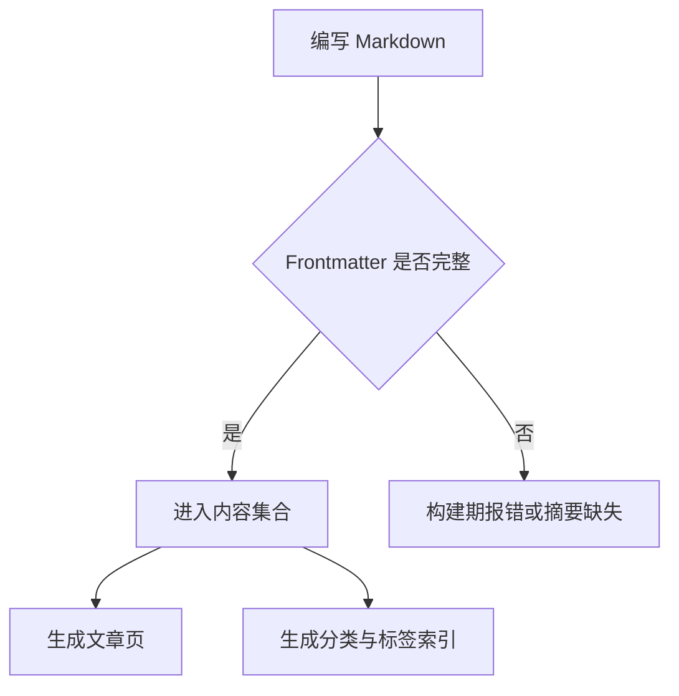
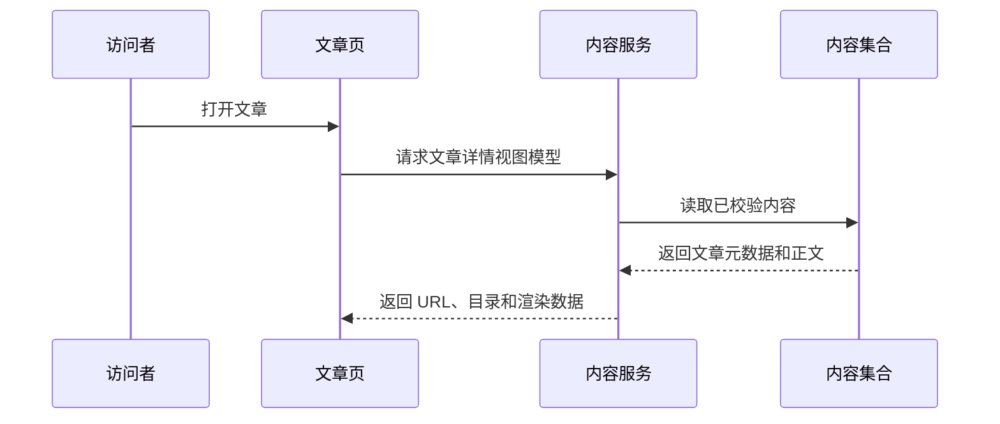
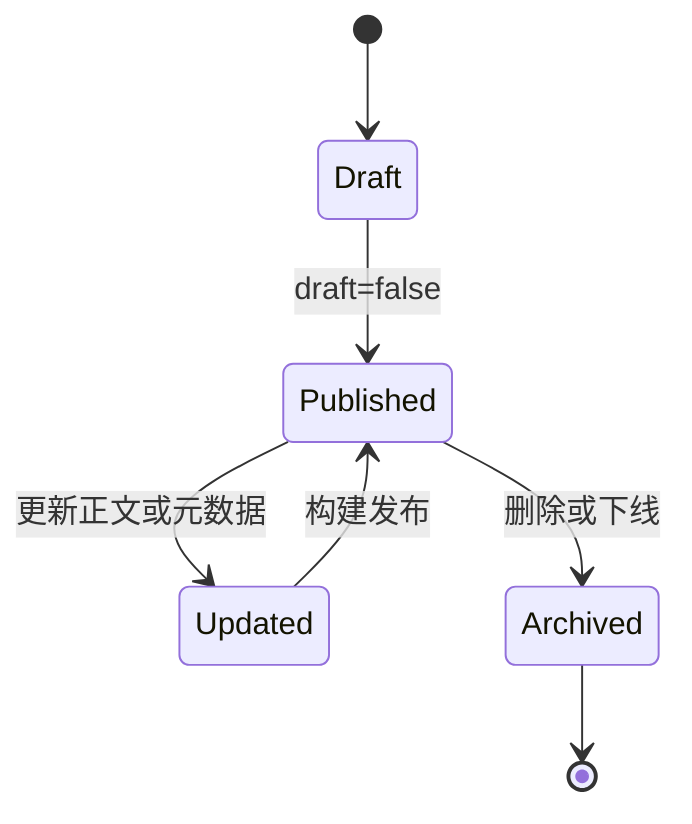
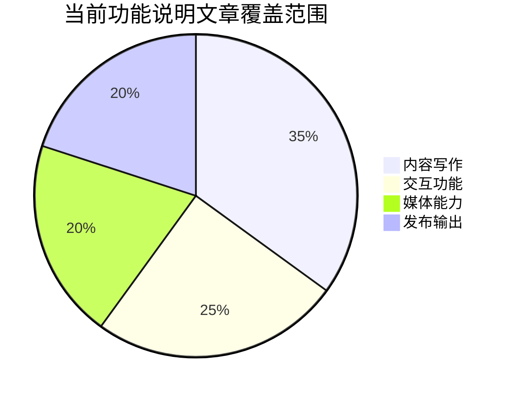

Mermaid 适合在文章里表达流程、交互关系、状态变化和简单数据占比。它的优势是图表源文本和文章一起维护，不需要额外提交截图。

## 流程图

流程图适合解释构建管线、发布流程和故障排查步骤。

## 时序图

时序图适合说明多个模块之间的调用顺序。

## 状态图

状态图适合描述文章生命周期、交互开关和用户界面状态。

## 饼图

饼图适合表达简单比例。复杂数据仍建议使用更明确的表格或专门的可视化组件。

## 写作建议

Mermaid 图表应保持简短。图表节点过多时，移动端阅读会变差，也更容易让维护者误读关系。

站点使用本地打包的固定版本 `mermaid@11.17.2`，运行时文件发布为 `/assets/js/mermaid-11.17.2.min.js`，并以 `securityLevel: "strict"` 渲染图表。文章中的 Mermaid 应作为静态说明图使用，不要依赖 HTML label、click 回调或外链交互；如果内容需要点击、筛选、展开等操作，应改用专门的页面组件。

复杂图表应在源码中提供 `accTitle` 和 `accDescr`。`accTitle` 用一句话概括图表主题，`accDescr` 说明图表表达的关键关系；如果图表信息量过大，还应在正文中提供等价文字说明。

如果图表表达的是项目真实行为，更新代码或配置后也要同步更新图表。过期图表比没有图表更容易误导读者。
